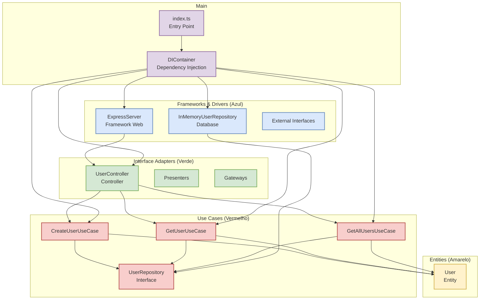

# Visão Geral da Arquitetura

## Diagrama das Camadas da Clean Architecture

## Princípios Fundamentais

### Regra de Dependência
- **Direção das dependências**: Sempre apontam para dentro (das camadas externas para as internas)
- **Camadas internas**: Não conhecem as camadas externas
- **Inversão de controle**: Interfaces definidas nas camadas internas, implementadas nas externas

### Separação de Responsabilidades
- **Entities**: Regras de negócio empresariais
- **Use Cases**: Regras de negócio da aplicação
- **Interface Adapters**: Conversão de dados entre formatos
- **Frameworks & Drivers**: Detalhes de implementação 