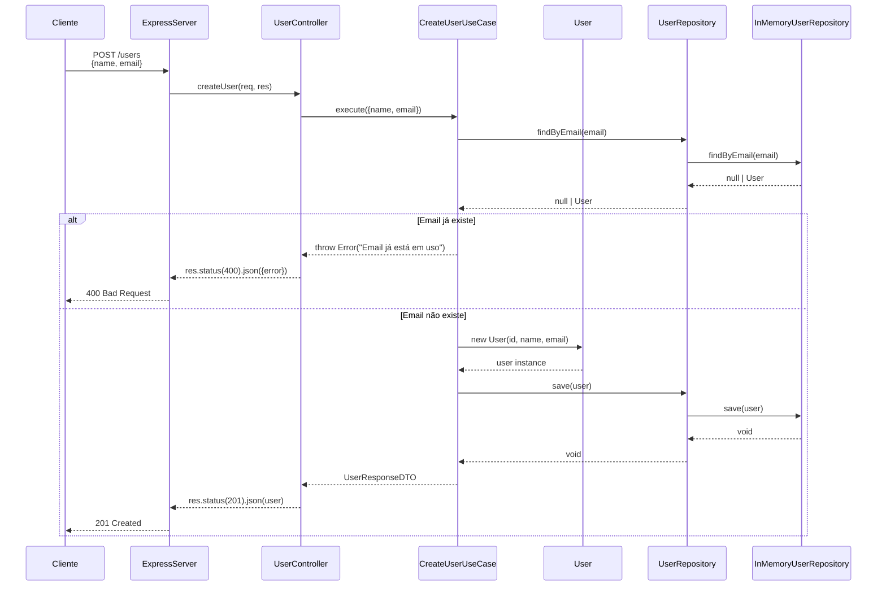
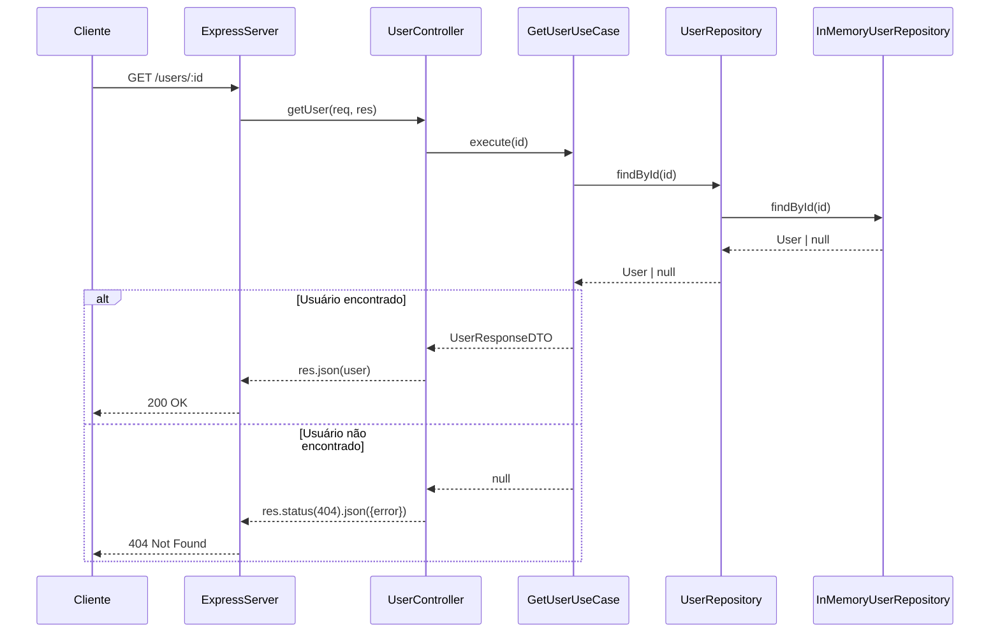
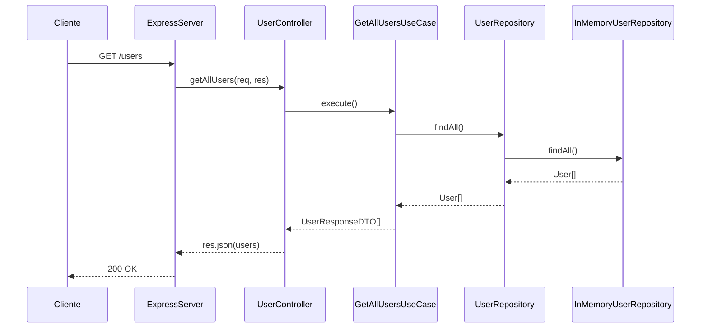

# Fluxo de Dados na Aplicação

## Diagrama de Fluxo - Criar Usuário

```mermaid
sequenceDiagram
    participant Client as Cliente
    participant Express as ExpressServer
    participant Controller as UserController
    participant UseCase as CreateUserUseCase
    participant Entity as User
    participant Repo as UserRepository
    participant DB as InMemoryUserRepository

    Client->>Express: POST /users<br/>{name, email}
    Express->>Controller: createUser(req, res)
    Controller->>UseCase: execute({name, email})
    
    UseCase->>Repo: findByEmail(email)
    Repo->>DB: findByEmail(email)
    DB-->>Repo: null | User
    Repo-->>UseCase: null | User
    
    alt Email já existe
        UseCase-->>Controller: throw Error("Email já está em uso")
        Controller-->>Express: res.status(400).json({error})
        Express-->>Client: 400 Bad Request
    else Email não existe
        UseCase->>Entity: new User(id, name, email)
        Entity-->>UseCase: user instance
        UseCase->>Repo: save(user)
        Repo->>DB: save(user)
        DB-->>Repo: void
        Repo-->>UseCase: void
        UseCase-->>Controller: UserResponseDTO
        Controller-->>Express: res.status(201).json(user)
        Express-->>Client: 201 Created
    end
```

## Diagrama de Fluxo - Buscar Usuário

```mermaid
sequenceDiagram
    participant Client as Cliente
    participant Express as ExpressServer
    participant Controller as UserController
    participant UseCase as GetUserUseCase
    participant Repo as UserRepository
    participant DB as InMemoryUserRepository

    Client->>Express: GET /users/:id
    Express->>Controller: getUser(req, res)
    Controller->>UseCase: execute(id)
    UseCase->>Repo: findById(id)
    Repo->>DB: findById(id)
    DB-->>Repo: User | null
    Repo-->>UseCase: User | null
    
    alt Usuário encontrado
        UseCase-->>Controller: UserResponseDTO
        Controller-->>Express: res.json(user)
        Express-->>Client: 200 OK
    else Usuário não encontrado
        UseCase-->>Controller: null
        Controller-->>Express: res.status(404).json({error})
        Express-->>Client: 404 Not Found
    end
```

## Diagrama de Fluxo - Listar Usuários

```mermaid
sequenceDiagram
    participant Client as Cliente
    participant Express as ExpressServer
    participant Controller as UserController
    participant UseCase as GetAllUsersUseCase
    participant Repo as UserRepository
    participant DB as InMemoryUserRepository

    Client->>Express: GET /users
    Express->>Controller: getAllUsers(req, res)
    Controller->>UseCase: execute()
    UseCase->>Repo: findAll()
    Repo->>DB: findAll()
    DB-->>Repo: User[]
    Repo-->>UseCase: User[]
    UseCase-->>Controller: UserResponseDTO[]
    Controller-->>Express: res.json(users)
    Express-->>Client: 200 OK
``` 