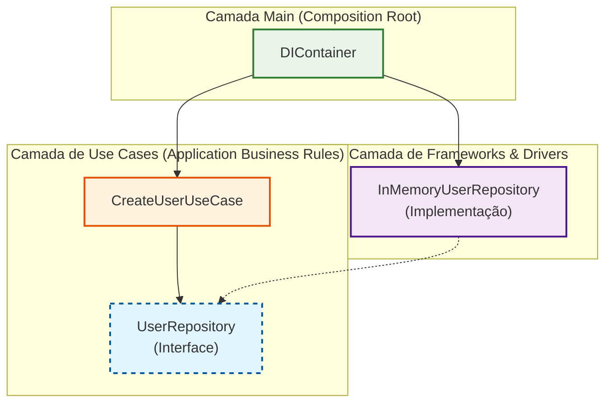

# Inversão de Dependências

## Diagrama de Inversão de Dependências

```mermaid
graph TB
    subgraph "Camada de Use Cases (Application Business Rules)"
        UC["CreateUserUseCase"]
        REPO_INTERFACE["UserRepository<br/>(Interface)"]
    end
    
    subgraph "Camada de Frameworks & Drivers"
        REPO_IMPL["InMemoryUserRepository<br/>(Implementação)"]
    end
    
    subgraph "Camada Main (Composition Root)"
        DI_CONTAINER["DIContainer"]
    end
    
    UC --> REPO_INTERFACE
    REPO_IMPL -.-> REPO_INTERFACE
    DI_CONTAINER --> UC
    DI_CONTAINER --> REPO_IMPL
    
    classDef interface fill:#e1f5fe,stroke:#01579b,stroke-width:2px,stroke-dasharray: 5 5
    classDef implementation fill:#f3e5f5,stroke:#4a148c,stroke-width:2px
    classDef usecase fill:#fff3e0,stroke:#e65100,stroke-width:2px
    classDef main fill:#e8f5e8,stroke:#2e7d32,stroke-width:2px
    
    class REPO_INTERFACE interface
    class REPO_IMPL implementation
    class UC usecase
    class DI_CONTAINER main
```
 