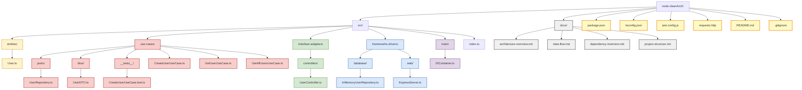

# Estrutura do Projeto

## Diagrama da Estrutura de Pastas

```mermaid
graph TD
    ROOT["node-cleanArch/"]
    
    ROOT --> SRC["src/"]
    ROOT --> DOCS["docs/"]
    ROOT --> PKG["package.json"]
    ROOT --> TS["tsconfig.json"]
    ROOT --> JEST["jest.config.js"]
    ROOT --> REQ["requests.http"]
    ROOT --> README["README.md"]
    ROOT --> GIT[".gitignore"]
    
    SRC --> ENTITIES["entities/"]
    SRC --> USECASES["use-cases/"]
    SRC --> ADAPTERS["interface-adapters/"]
    SRC --> FRAMEWORKS["frameworks-drivers/"]
    SRC --> MAIN["main/"]
    SRC --> INDEX["index.ts"]
    
    ENTITIES --> USER_ENTITY["User.ts"]
    
    USECASES --> PORTS["ports/"]
    USECASES --> DTOS["dtos/"]
    USECASES --> TESTS["__tests__/"]
    USECASES --> CREATE_UC["CreateUserUseCase.ts"]
    USECASES --> GET_UC["GetUserUseCase.ts"]
    USECASES --> GETALL_UC["GetAllUsersUseCase.ts"]
    
    PORTS --> REPO_PORT["UserRepository.ts"]
    DTOS --> USER_DTO["UserDTO.ts"]
    TESTS --> CREATE_TEST["CreateUserUseCase.test.ts"]
    
    ADAPTERS --> CONTROLLERS["controllers/"]
    CONTROLLERS --> USER_CTRL["UserController.ts"]
    
    FRAMEWORKS --> DATABASE["database/"]
    FRAMEWORKS --> WEB["web/"]
    DATABASE --> MEMORY_REPO["InMemoryUserRepository.ts"]
    WEB --> EXPRESS_SERVER["ExpressServer.ts"]
    
    MAIN --> DI_CONTAINER["DIContainer.ts"]
    
    DOCS --> ARCH_DOC["architecture-overview.md"]
    DOCS --> FLOW_DOC["data-flow.md"]
    DOCS --> DEP_DOC["dependency-inversion.md"]
    DOCS --> STRUCT_DOC["project-structure.md"]
    
    classDef entities fill:#fff2cc,stroke:#d6b656,stroke-width:2px
    classDef usecases fill:#f8cecc,stroke:#b85450,stroke-width:2px
    classDef adapters fill:#d5e8d4,stroke:#82b366,stroke-width:2px
    classDef frameworks fill:#dae8fc,stroke:#6c8ebf,stroke-width:2px
    classDef main fill:#e1d5e7,stroke:#9673a6,stroke-width:2px
    classDef docs fill:#f0f0f0,stroke:#666666,stroke-width:2px
    classDef config fill:#fff9c4,stroke:#f57c00,stroke-width:2px
    
    class ENTITIES,USER_ENTITY entities
    class USECASES,PORTS,DTOS,TESTS,CREATE_UC,GET_UC,GETALL_UC,REPO_PORT,USER_DTO,CREATE_TEST usecases
    class ADAPTERS,CONTROLLERS,USER_CTRL adapters
    class FRAMEWORKS,DATABASE,WEB,MEMORY_REPO,EXPRESS_SERVER frameworks
    class MAIN,DI_CONTAINER main
    class DOCS,ARCH_DOC,FLOW_DOC,DEP_DOC,STRUCT_DOC docs
    class PKG,TS,JEST,REQ,README,GIT config
```
 