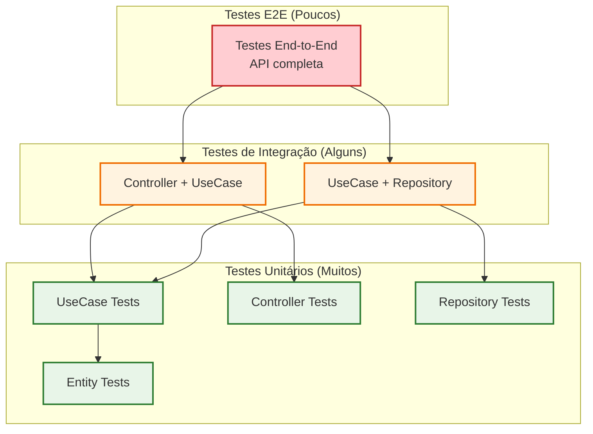
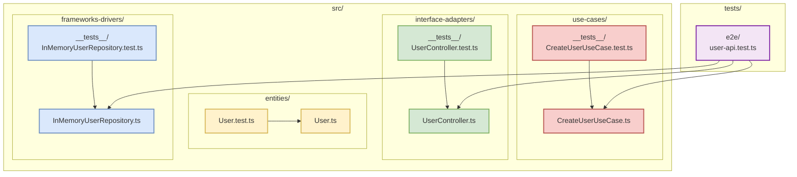
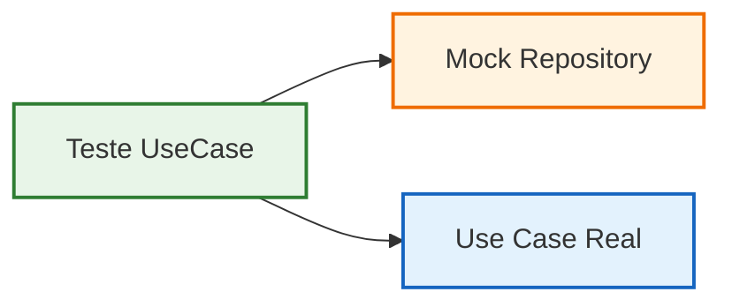

# Estratégia de Testes

## Pirâmide de Testes na Clean Architecture



## Estrutura de Testes por Camada



## Exemplo de Teste Unitário (Use Case)

```typescript
// src/use-cases/__tests__/CreateUserUseCase.test.ts
describe('CreateUserUseCase', () => {
  let useCase: CreateUserUseCase;
  let mockRepository: MockUserRepository;

  beforeEach(() => {
    mockRepository = new MockUserRepository();
    useCase = new CreateUserUseCase(mockRepository);
  });

  it('deve criar um usuário com dados válidos', async () => {
    // Arrange
    const userData = {
      name: 'João Silva',
      email: 'joao@email.com'
    };

    // Act
    const result = await useCase.execute(userData);

    // Assert
    expect(result).toBeDefined();
    expect(result.name).toBe(userData.name);
    expect(result.email).toBe(userData.email);
  });
});
```

## Benefícios dos Testes na Clean Architecture

### 1. Isolamento de Camadas


### 2. Facilidade de Mock
- **Interfaces bem definidas**: Fácil criar mocks
- **Dependências injetadas**: Substituição simples
- **Lógica isolada**: Testes focados

### 3. Tipos de Teste

#### Testes Unitários
- **Entity**: Validações e regras de negócio
- **Use Case**: Lógica da aplicação com mocks
- **Controller**: Manipulação de requisições

#### Testes de Integração
- **Use Case + Repository**: Sem mocks do repositório
- **Controller + Use Case**: Fluxo completo da API

#### Testes E2E
- **API completa**: Servidor real + banco real
- **Cenários de usuário**: Fluxos completos

## Comandos de Teste

```bash
# Executar todos os testes
npm test

# Executar testes com cobertura
npm run test:coverage

# Executar testes em modo watch
npm run test:watch

# Executar apenas testes unitários
npm run test:unit

# Executar apenas testes de integração
npm run test:integration

# Executar apenas testes E2E
npm run test:e2e
``` 