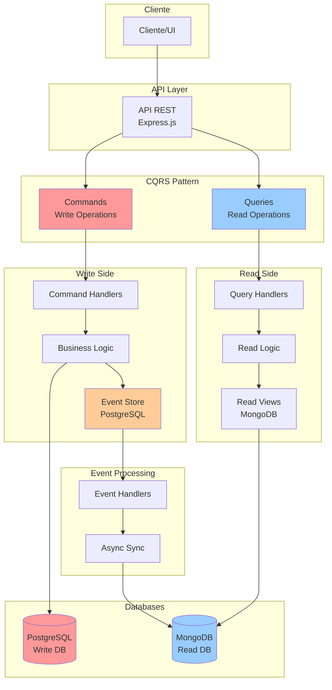

# Arquitetura Geral CQRS

## Visão Geral

Este diagrama mostra a arquitetura completa do sistema CQRS implementado, demonstrando a separação clara entre operações de leitura e escrita.



## Componentes Principais

### 1. Cliente / UI
- Aplicações frontend, testes, scripts
- Consome a API REST
- Pode ser web, mobile, CLI, etc.

### 2. API Layer (Express.js)
- Ponto de entrada único
- Roteamento HTTP
- Middleware de autenticação, validação, CORS
- Separação entre Commands e Queries

### 3. CQRS Pattern

#### Commands (Lado da Escrita) - Vermelho
- **Responsabilidade**: Modificar estado do sistema
- **Operações**: CREATE, UPDATE, DELETE
- **Base de Dados**: PostgreSQL
- **Características**: ACID, Transações, Consistência

#### Queries (Lado da Leitura) - Azul
- **Responsabilidade**: Consultar dados
- **Operações**: READ, SEARCH, FILTER
- **Base de Dados**: MongoDB
- **Características**: Performance, Flexibilidade, Desnormalização

### 4. Write Side (Lado da Escrita)

#### Command Handlers
- Arquivo: `src/commands/ProductCommands.js`
- Recebem e processam commands
- Aplicam regras de negócio
- Validam dados de entrada

#### Business Logic
- Lógica específica do domínio
- Validações de negócio
- Transformações de dados
- Aplicação de regras

#### Event Store
- Arquivo: `src/eventStore/EventStore.js`
- Armazena todos os eventos
- Permite auditoria completa
- Possibilita replay de eventos
- Base: PostgreSQL

### 5. Event Processing (Processamento de Eventos)

#### Event Handlers
- Arquivo: `src/eventHandlers/ProductEventHandler.js`
- Escutam eventos do Event Store
- Processamento assíncrono
- Atualizam o Read Model

#### Async Sync
- Sincronização entre bases
- Garantia de consistência eventual
- Processamento em background

### 6. Read Side (Lado da Leitura)

#### Query Handlers
- Arquivo: `src/queries/ProductQueries.js`
- Processam queries otimizadas
- Aplicam filtros e paginação
- Formatam resultados

#### Read Logic
- Lógica específica de consulta
- Agregações e cálculos
- Transformações para apresentação

#### Read Views
- Modelo: `src/models/ProductRead.js`
- Dados desnormalizados
- Otimizados para consulta
- Índices específicos

### 7. Databases

#### PostgreSQL (Write DB)
- **Uso**: Comandos e Event Store
- **Características**: ACID, Transações, Consistência
- **Tabelas**: products, events
- **Docker**: Porta 5432

#### MongoDB (Read DB)
- **Uso**: Queries e Read Views
- **Características**: Performance, Flexibilidade
- **Collections**: products (desnormalizada)
- **Docker**: Porta 27017

## Fluxo de Dados

### 1. Comando (Escrita)
```
Cliente → API → Command → Handler → Business Logic → PostgreSQL + Event Store
                                                    ↓
Event Handler ← Event Store
                ↓
MongoDB ← Sync Process
```

### 2. Query (Leitura)
```
Cliente → API → Query → Handler → Read Logic → MongoDB → Resultado
```

## Vantagens desta Arquitetura

### Separação de Responsabilidades
- Write e Read têm responsabilidades claras
- Otimização específica para cada caso
- Evolução independente

### Performance
- Queries otimizadas (MongoDB)
- Commands otimizados (PostgreSQL)
- Processamento assíncrono

### Escalabilidade
- Read e Write escalam independentemente
- Múltiplas instâncias de leitura
- Cache de consultas

### Flexibilidade
- Múltiplas views dos dados
- Queries complexas sem impacto na escrita
- Adaptação a diferentes necessidades

### Auditoria e Debug
- Histórico completo de eventos
- Capacidade de replay
- Debug detalhado de operações

---

**Próximo**: [Fluxo de Commands (Escrita)](./02-fluxo-commands.md) 