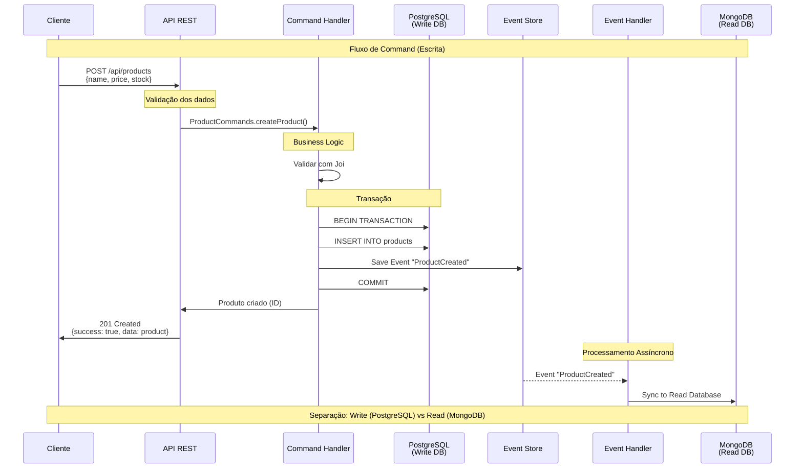

# Fluxo de Commands (Escrita)

## Visão Geral

Este diagrama detalha o fluxo completo de um **Command** (operação de escrita) no sistema CQRS, desde a requisição do cliente até a sincronização com o Read Model.



## Etapas Detalhadas

### 1. Requisição do Cliente
```http
POST /api/products
Content-Type: application/json

{
    "name": "Produto Exemplo",
    "price": 99.90,
    "stock": 50
}
```

**Arquivo**: Cliente/Frontend/Postman/curl

### 2. API REST (Express.js)
```javascript
// src/routes/products.js
router.post('/', async (req, res) => {
    try {
        const result = await ProductCommands.createProduct(req.body);
        res.status(201).json({ success: true, data: result });
    } catch (error) {
        res.status(400).json({ success: false, error: error.message });
    }
});
```

**Responsabilidades**:
- Validação inicial da requisição
- Roteamento para o Command Handler apropriado
- Tratamento de erros HTTP
- Formatação da resposta

### 3. Command Handler
```javascript
// src/commands/ProductCommands.js
class ProductCommands {
    static async createProduct(productData) {
        // 1. Validação com Joi
        const { error, value } = productSchema.validate(productData);
        if (error) throw new Error(`Validation error: ${error.details[0].message}`);
        
        // 2. Gerar ID único
        const productId = uuidv4();
        
        // 3. Criar produto com timestamp
        const product = {
            id: productId,
            ...value,
            createdAt: new Date(),
            updatedAt: new Date()
        };
        
        // 4. Transação PostgreSQL + Event Store
        const result = await this.executeWithTransaction(product);
        return result;
    }
}
```

**Responsabilidades**:
- Validação de dados de entrada (Joi)
- Aplicação de regras de negócio
- Geração de IDs únicos
- Coordenação de transações

### 4. Transação PostgreSQL
```javascript
// Dentro do Command Handler
async executeWithTransaction(product) {
    const client = await pgPool.connect();
    
    try {
        await client.query('BEGIN');
        
        // 4.1. Insert no PostgreSQL
        const insertQuery = `
            INSERT INTO products (id, name, price, stock, created_at, updated_at)
            VALUES ($1, $2, $3, $4, $5, $6)
            RETURNING *
        `;
        const result = await client.query(insertQuery, [
            product.id, product.name, product.price, 
            product.stock, product.createdAt, product.updatedAt
        ]);
        
        // 4.2. Event Store
        const event = {
            eventType: 'ProductCreated',
            aggregateId: product.id,
            eventData: product,
            eventVersion: 1,
            timestamp: new Date()
        };
        
        await EventStore.saveEvent(event, client);
        
        await client.query('COMMIT');
        return result.rows[0];
        
    } catch (error) {
        await client.query('ROLLBACK');
        throw error;
    } finally {
        client.release();
    }
}
```

**Características**:
- **ACID**: Atomicidade, Consistência, Isolamento, Durabilidade
- **Transação**: Tudo ou nada
- **Rollback**: Em caso de erro, desfaz tudo
- **Event Store**: Salvo na mesma transação

### 5. Event Store
```javascript
// src/eventStore/EventStore.js
class EventStore {
    static async saveEvent(event, client = null) {
        const query = `
            INSERT INTO events (
                event_id, event_type, aggregate_id, event_data, 
                event_version, timestamp
            )
            VALUES ($1, $2, $3, $4, $5, $6)
            RETURNING *
        `;
        
        const values = [
            uuidv4(),
            event.eventType,
            event.aggregateId,
            JSON.stringify(event.eventData),
            event.eventVersion,
            event.timestamp
        ];
        
        const result = await (client || pgPool).query(query, values);
        
        // Trigger async event processing
        this.processEventAsync(event);
        
        return result.rows[0];
    }
}
```

**Responsabilidades**:
- Armazenar eventos de forma durável
- Manter ordem cronológica
- Disparar processamento assíncrono
- Permitir replay de eventos

### 6. Resposta Imediata ao Cliente
```json
{
    "success": true,
    "data": {
        "id": "550e8400-e29b-41d4-a716-446655440000",
        "name": "Produto Exemplo",
        "price": 99.90,
        "stock": 50,
        "createdAt": "2024-01-01T10:00:00.000Z",
        "updatedAt": "2024-01-01T10:00:00.000Z"
    }
}
```

**Características**:
- **Resposta Rápida**: Cliente não espera sincronização
- **Confirmação**: Command foi processado com sucesso
- **ID Gerado**: Cliente recebe ID do produto criado

### 7. Processamento Assíncrono de Eventos
```javascript
// src/eventHandlers/ProductEventHandler.js
class ProductEventHandler {
    static async handleProductCreated(event) {
        try {
            const productData = event.eventData;
            
            // Criar/atualizar no MongoDB (Read Model)
            const productRead = new ProductRead({
                productId: productData.id,
                name: productData.name,
                price: productData.price,
                stock: productData.stock,
                isActive: true,
                createdAt: productData.createdAt,
                updatedAt: productData.updatedAt,
                // Campos extras para otimização de queries
                searchText: productData.name.toLowerCase(),
                priceRange: this.getPriceRange(productData.price)
            });
            
            await productRead.save();
            
            console.log(`✅ Product synced to Read DB: ${productData.id}`);
            
        } catch (error) {
            console.error('❌ Error syncing product:', error);
            // Aqui poderia implementar retry logic
        }
    }
}
```

**Características**:
- **Assíncrono**: Não bloqueia o Command
- **Eventual Consistency**: Read Model atualizado posteriormente
- **Enriquecimento**: Adiciona campos otimizados para consulta
- **Error Handling**: Tratamento independente de erros

## Tipos de Commands Implementados

### 1. CreateProduct
- **Endpoint**: `POST /api/products`
- **Validação**: name (required), price (positive), stock (non-negative)
- **Evento**: `ProductCreated`

### 2. UpdateProduct
- **Endpoint**: `PUT /api/products/:id`
- **Validação**: Produto deve existir, campos opcionais
- **Evento**: `ProductUpdated`

### 3. DeleteProduct
- **Endpoint**: `DELETE /api/products/:id`
- **Validação**: Produto deve existir
- **Evento**: `ProductDeleted`

## Validações Implementadas

### Schema Joi
```javascript
const productSchema = Joi.object({
    name: Joi.string().min(1).max(100).required(),
    price: Joi.number().positive().precision(2).required(),
    stock: Joi.number().integer().min(0).required()
});
```

### Regras de Negócio
- Nome não pode ser vazio
- Preço deve ser positivo
- Estoque não pode ser negativo
- IDs são UUIDs v4
- Timestamps automáticos

## Tratamento de Erros

### Tipos de Erro
1. **Validação**: Dados inválidos (400)
2. **Negócio**: Regras violadas (422)
3. **Database**: Problemas de conexão (500)
4. **Concorrência**: Conflitos (409)

### Exemplo de Resposta de Erro
```json
{
    "success": false,
    "error": "Validation error: price must be a positive number",
    "code": "VALIDATION_ERROR"
}
```

## Benefícios do Fluxo

### 1. Consistência
- Transações ACID garantem consistência
- Rollback automático em caso de erro
- Event Store sincronizado

### 2. Performance
- Resposta rápida ao cliente
- Processamento assíncrono
- Write otimizado (PostgreSQL)

### 3. Auditoria
- Todos os eventos são registrados
- Histórico completo de mudanças
- Capacidade de replay

### 4. Escalabilidade
- Commands podem ser processados em paralelo
- Event processing assíncrono
- Read Model atualizado independentemente

---

**Anterior**: [Arquitetura Geral CQRS](./01-arquitetura-geral.md) | **Próximo**: [Fluxo de Queries (Leitura)](./03-fluxo-queries.md) 