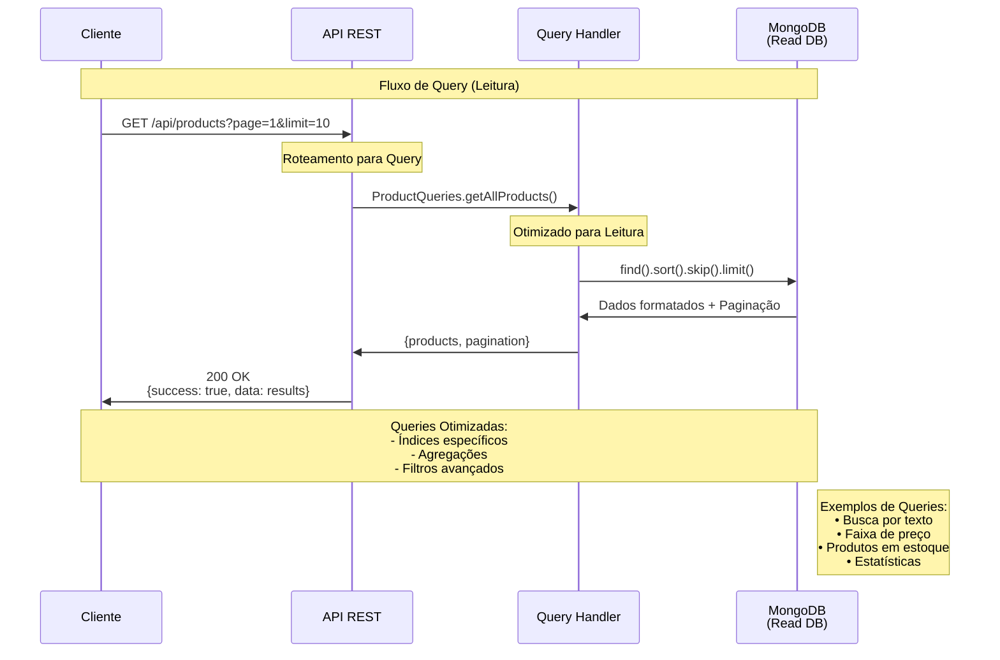

# Fluxo de Queries (Leitura)

## Visão Geral

Este diagrama detalha o fluxo completo de uma **Query** (operação de leitura) no sistema CQRS, mostrando como as consultas são otimizadas para performance usando MongoDB.



## Etapas Detalhadas

### 1. Requisição do Cliente

#### Exemplos de Queries Suportadas:

```http
# 1. Listar todos os produtos com paginação
GET /api/products?page=1&limit=10

# 2. Buscar produtos por nome
GET /api/products?search=notebook

# 3. Filtrar por faixa de preço
GET /api/products?minPrice=100&maxPrice=500

# 4. Filtrar produtos em estoque
GET /api/products?inStock=true

# 5. Ordenar por preço
GET /api/products?sortBy=price&sortOrder=desc

# 6. Combinar filtros
GET /api/products?search=notebook&minPrice=1000&inStock=true&page=1&limit=5
```

### 2. API REST (Express.js)

```javascript
// src/routes/products.js
router.get('/', async (req, res) => {
    try {
        const queryParams = {
            page: parseInt(req.query.page) || 1,
            limit: parseInt(req.query.limit) || 10,
            search: req.query.search,
            minPrice: req.query.minPrice ? parseFloat(req.query.minPrice) : null,
            maxPrice: req.query.maxPrice ? parseFloat(req.query.maxPrice) : null,
            inStock: req.query.inStock === 'true',
            sortBy: req.query.sortBy || 'createdAt',
            sortOrder: req.query.sortOrder || 'desc'
        };
        
        const result = await ProductQueries.getAllProducts(queryParams);
        
        res.json({
            success: true,
            data: result.products,
            pagination: result.pagination
        });
        
    } catch (error) {
        res.status(500).json({ 
            success: false, 
            error: error.message 
        });
    }
});
```

**Responsabilidades**:
- Parseamento de query parameters
- Validação de tipos (números, booleanos)
- Valores padrão para paginação
- Roteamento para Query Handler
- Formatação da resposta

### 3. Query Handler

```javascript
// src/queries/ProductQueries.js
class ProductQueries {
    static async getAllProducts(params) {
        const {
            page = 1,
            limit = 10,
            search,
            minPrice,
            maxPrice,
            inStock,
            sortBy = 'createdAt',
            sortOrder = 'desc'
        } = params;
        
        // 1. Construir filtros MongoDB
        const filters = await this.buildFilters({
            search, minPrice, maxPrice, inStock
        });
        
        // 2. Configurar paginação
        const skip = (page - 1) * limit;
        
        // 3. Configurar ordenação
        const sort = { [sortBy]: sortOrder === 'desc' ? -1 : 1 };
        
        // 4. Executar query otimizada
        const [products, total] = await Promise.all([
            ProductRead.find(filters)
                      .sort(sort)
                      .skip(skip)
                      .limit(limit)
                      .lean(), // Melhor performance
            ProductRead.countDocuments(filters)
        ]);
        
        // 5. Calcular informações de paginação
        const pagination = this.calculatePagination(page, limit, total);
        
        return { products, pagination };
    }
    
    static buildFilters({ search, minPrice, maxPrice, inStock }) {
        const filters = { isActive: true };
        
        // Busca por texto (índice text)
        if (search) {
            filters.$text = { $search: search };
        }
        
        // Faixa de preço
        if (minPrice !== null || maxPrice !== null) {
            filters.price = {};
            if (minPrice !== null) filters.price.$gte = minPrice;
            if (maxPrice !== null) filters.price.$lte = maxPrice;
        }
        
        // Produtos em estoque
        if (inStock) {
            filters.stock = { $gt: 0 };
        }
        
        return filters;
    }
}
```

**Responsabilidades**:
- Construção de filtros MongoDB
- Otimização de queries
- Paginação eficiente
- Cálculos de agregação
- Formatação de resultados

### 4. MongoDB (Read Database)

#### Model Otimizado para Leitura
```javascript
// src/models/ProductRead.js
const productReadSchema = new mongoose.Schema({
    productId: { type: String, required: true, unique: true },
    name: { type: String, required: true },
    price: { type: Number, required: true },
    stock: { type: Number, required: true },
    isActive: { type: Boolean, default: true },
    
    // Campos otimizados para busca
    searchText: { type: String, index: 'text' },
    priceRange: { type: String }, // 'low', 'medium', 'high'
    
    // Timestamps
    createdAt: { type: Date, default: Date.now },
    updatedAt: { type: Date, default: Date.now },
    
    // Campos desnormalizados para performance
    categoryName: String,
    brandName: String,
    totalSales: { type: Number, default: 0 },
    averageRating: { type: Number, default: 0 }
});

// Índices para performance
productReadSchema.index({ name: 1 });
productReadSchema.index({ price: 1 });
productReadSchema.index({ stock: 1 });
productReadSchema.index({ createdAt: -1 });
productReadSchema.index({ priceRange: 1 });
productReadSchema.index({ isActive: 1 });

// Índice composto para queries complexas
productReadSchema.index({ 
    isActive: 1, 
    price: 1, 
    stock: 1 
});

// Índice de texto para busca
productReadSchema.index({ 
    name: 'text', 
    searchText: 'text' 
});
```

#### Queries MongoDB Otimizadas
```javascript
// Exemplo de query gerada
db.products.find({
    isActive: true,
    $text: { $search: "notebook" },
    price: { $gte: 1000, $lte: 5000 },
    stock: { $gt: 0 }
})
.sort({ price: -1 })
.skip(0)
.limit(10)
```

**Características**:
- **Índices**: Múltiplos índices para performance
- **Text Search**: Busca full-text nativa
- **Lean Queries**: Retorna objetos JavaScript simples
- **Agregações**: Cálculos complexos no banco
- **Projeções**: Retorna apenas campos necessários

### 5. Resposta Formatada

```json
{
    "success": true,
    "data": [
        {
            "productId": "550e8400-e29b-41d4-a716-446655440000",
            "name": "Notebook Dell",
            "price": 2500.00,
            "stock": 15,
            "isActive": true,
            "priceRange": "high",
            "createdAt": "2024-01-01T10:00:00.000Z",
            "updatedAt": "2024-01-01T10:00:00.000Z"
        }
    ],
    "pagination": {
        "page": 1,
        "limit": 10,
        "total": 25,
        "pages": 3,
        "hasNext": true,
        "hasPrev": false
    }
}
```

## Tipos de Queries Implementadas

### 1. GetAllProducts
```javascript
// GET /api/products
ProductQueries.getAllProducts(queryParams)
```
- Paginação
- Filtros múltiplos
- Ordenação dinâmica
- Busca por texto

### 2. GetProductById
```javascript
// GET /api/products/:id
ProductQueries.getProductById(productId)
```
- Busca por ID único
- Validação de existência
- Campos completos

### 3. SearchProducts
```javascript
// GET /api/products/search?q=termo
ProductQueries.searchProducts(searchTerm, options)
```
- Full-text search
- Relevância por score
- Sugestões automáticas

### 4. GetProductStats
```javascript
// GET /api/products/stats
ProductQueries.getProductStats()
```
- Agregações MongoDB
- Estatísticas em tempo real
- Dashboards

### 5. GetProductsByCategory
```javascript
// GET /api/products/category/:category
ProductQueries.getProductsByCategory(category, options)
```
- Filtro por categoria
- Ordenação personalizada
- Cache otimizado

## Otimizações Implementadas

### 1. Índices MongoDB
```javascript
// Índices criados automaticamente
{
    "name": 1,
    "price": 1,
    "stock": 1,
    "createdAt": -1,
    "isActive": 1,
    "priceRange": 1
}

// Índice composto
{
    "isActive": 1,
    "price": 1,
    "stock": 1
}

// Índice de texto
{
    "name": "text",
    "searchText": "text"
}
```

### 2. Query Optimization
```javascript
// Lean queries para performance
.lean() // Retorna objetos JS simples

// Projeção para campos específicos
.select('name price stock')

// Limit early para grandes datasets
.limit(1000)

// Agregação pipeline otimizada
.aggregate([
    { $match: filters },
    { $sort: { createdAt: -1 } },
    { $skip: skip },
    { $limit: limit }
])
```

### 3. Caching Strategy
```javascript
// Cache em memória para queries frequentes
const cache = new Map();

static async getCachedProducts(key, queryFn) {
    if (cache.has(key)) {
        return cache.get(key);
    }
    
    const result = await queryFn();
    cache.set(key, result);
    
    // TTL de 5 minutos
    setTimeout(() => cache.delete(key), 5 * 60 * 1000);
    
    return result;
}
```

## Paginação Avançada

### Implementação
```javascript
static calculatePagination(page, limit, total) {
    const totalPages = Math.ceil(total / limit);
    
    return {
        page: parseInt(page),
        limit: parseInt(limit),
        total: parseInt(total),
        pages: totalPages,
        hasNext: page < totalPages,
        hasPrev: page > 1,
        nextPage: page < totalPages ? page + 1 : null,
        prevPage: page > 1 ? page - 1 : null
    };
}
```

### Exemplo de Uso
```javascript
// Página 2, 10 itens por página, 25 total
{
    "page": 2,
    "limit": 10,
    "total": 25,
    "pages": 3,
    "hasNext": true,
    "hasPrev": true,
    "nextPage": 3,
    "prevPage": 1
}
```

## Benefícios das Queries

### 1. Performance
- Índices otimizados para cada tipo de busca
- Queries lean para menor uso de memória
- Agregações no banco de dados
- Cache inteligente

### 2. Flexibilidade
- Filtros combinados dinamicamente
- Ordenação por qualquer campo
- Busca full-text nativa
- Paginação eficiente

### 3. Escalabilidade
- Read replicas para distribuir carga
- Índices específicos por caso de uso
- Queries assíncronas
- Cache distribuído

### 4. User Experience
- Respostas rápidas (< 100ms)
- Paginação intuitiva
- Busca tolerante a erros
- Resultados relevantes

---

**Anterior**: [Fluxo de Commands (Escrita)](./02-fluxo-commands.md) | **Próximo**: [Event Store e Event Sourcing](./04-event-store.md) 