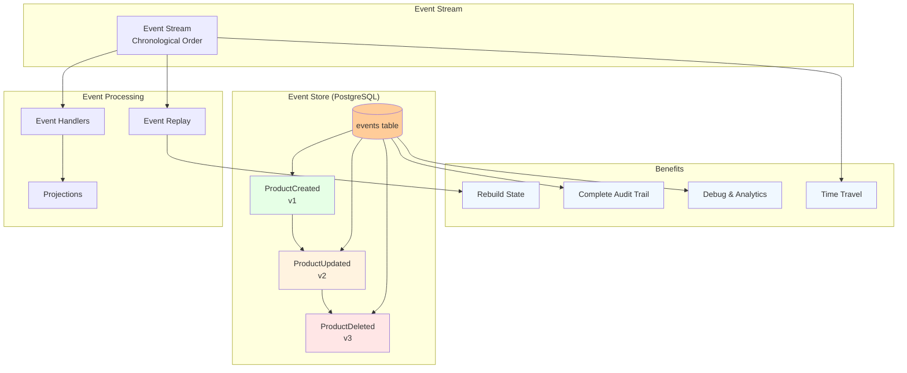

# Event Store e Event Sourcing

## Visão Geral

Este diagrama mostra como o **Event Store** funciona como o coração do sistema CQRS, armazenando todos os eventos e permitindo reconstrução completa do estado da aplicação.



## O que é Event Sourcing?

**Event Sourcing** é um padrão onde, em vez de armazenar apenas o estado atual dos dados, armazenamos toda a sequência de eventos que levaram a esse estado.

### Conceitos Fundamentais

#### 1. Events são Imutáveis
```javascript
// Evento nunca muda após ser criado
const event = {
    eventId: "uuid-v4",
    eventType: "ProductCreated",
    aggregateId: "product-123",
    eventData: { name: "Produto", price: 100 },
    eventVersion: 1,
    timestamp: "2024-01-01T10:00:00Z"
};
```

#### 2. Estado é Derivado
```javascript
// Estado atual = aplicação de todos os eventos
const currentState = events.reduce((state, event) => {
    return applyEvent(state, event);
}, initialState);
```

#### 3. Append-Only Storage
```sql
-- Eventos só são adicionados, nunca modificados ou removidos
INSERT INTO events (...) VALUES (...);
-- Sem UPDATE ou DELETE
```

## Estrutura do Event Store

### Tabela de Eventos (PostgreSQL)
```sql
CREATE TABLE events (
    event_id UUID PRIMARY KEY,
    event_type VARCHAR(100) NOT NULL,
    aggregate_id VARCHAR(100) NOT NULL,
    event_data JSONB NOT NULL,
    event_version INTEGER NOT NULL,
    timestamp TIMESTAMP WITH TIME ZONE DEFAULT CURRENT_TIMESTAMP,
    metadata JSONB DEFAULT '{}',
    
    -- Índices para performance
    INDEX idx_events_aggregate_id (aggregate_id),
    INDEX idx_events_timestamp (timestamp),
    INDEX idx_events_type (event_type),
    
    -- Índice composto para replay
    INDEX idx_events_aggregate_version (aggregate_id, event_version),
    
    -- Garantir ordem dos eventos por aggregate
    UNIQUE (aggregate_id, event_version)
);
```

### Implementação do Event Store
```javascript
// src/eventStore/EventStore.js
class EventStore {
    
    // Salvar evento
    static async saveEvent(event, client = null) {
        const query = `
            INSERT INTO events (
                event_id, event_type, aggregate_id, event_data, 
                event_version, timestamp, metadata
            )
            VALUES ($1, $2, $3, $4, $5, $6, $7)
            RETURNING *
        `;
        
        const values = [
            event.eventId || uuidv4(),
            event.eventType,
            event.aggregateId,
            JSON.stringify(event.eventData),
            event.eventVersion,
            event.timestamp || new Date(),
            JSON.stringify(event.metadata || {})
        ];
        
        const result = await (client || pgPool).query(query, values);
        
        // Trigger async processing
        setImmediate(() => this.processEventAsync(event));
        
        return result.rows[0];
    }
    
    // Obter todos os eventos de um aggregate
    static async getEventsForAggregate(aggregateId, fromVersion = 0) {
        const query = `
            SELECT * FROM events 
            WHERE aggregate_id = $1 
            AND event_version > $2
            ORDER BY event_version ASC
        `;
        
        const result = await pgPool.query(query, [aggregateId, fromVersion]);
        
        return result.rows.map(row => ({
            ...row,
            eventData: JSON.parse(row.event_data),
            metadata: JSON.parse(row.metadata)
        }));
    }
    
    // Replay de eventos
    static async replayEvents(aggregateId) {
        const events = await this.getEventsForAggregate(aggregateId);
        
        let state = null;
        
        for (const event of events) {
            state = this.applyEvent(state, event);
        }
        
        return state;
    }
    
    // Aplicar evento ao estado
    static applyEvent(currentState, event) {
        switch (event.event_type) {
            case 'ProductCreated':
                return {
                    id: event.aggregate_id,
                    ...event.eventData,
                    version: event.event_version
                };
                
            case 'ProductUpdated':
                return {
                    ...currentState,
                    ...event.eventData,
                    version: event.event_version
                };
                
            case 'ProductDeleted':
                return {
                    ...currentState,
                    isDeleted: true,
                    version: event.event_version
                };
                
            default:
                return currentState;
        }
    }
}
```

## Tipos de Eventos Implementados

### 1. ProductCreated
```javascript
{
    eventId: "uuid-v4",
    eventType: "ProductCreated",
    aggregateId: "product-123",
    eventData: {
        name: "Notebook Dell",
        price: 2500.00,
        stock: 10,
        createdAt: "2024-01-01T10:00:00Z"
    },
    eventVersion: 1,
    timestamp: "2024-01-01T10:00:00Z",
    metadata: {
        userId: "user-456",
        source: "web-admin",
        correlationId: "req-789"
    }
}
```

### 2. ProductUpdated
```javascript
{
    eventId: "uuid-v4",
    eventType: "ProductUpdated",
    aggregateId: "product-123",
    eventData: {
        price: 2300.00, // Preço alterado
        stock: 5,       // Estoque alterado
        updatedAt: "2024-01-02T14:30:00Z"
    },
    eventVersion: 2,
    timestamp: "2024-01-02T14:30:00Z",
    metadata: {
        userId: "user-456",
        source: "web-admin",
        reason: "price-adjustment",
        correlationId: "req-790"
    }
}
```

### 3. ProductDeleted
```javascript
{
    eventId: "uuid-v4",
    eventType: "ProductDeleted",
    aggregateId: "product-123",
    eventData: {
        deletedAt: "2024-01-03T09:15:00Z",
        reason: "discontinued"
    },
    eventVersion: 3,
    timestamp: "2024-01-03T09:15:00Z",
    metadata: {
        userId: "user-456",
        source: "web-admin",
        correlationId: "req-791"
    }
}
```

## Event Processing Assíncrono

### Event Handler
```javascript
// src/eventHandlers/ProductEventHandler.js
class ProductEventHandler {
    
    static async processEvent(event) {
        try {
            console.log(`📨 Processing event: ${event.event_type} for ${event.aggregate_id}`);
            
            switch (event.event_type) {
                case 'ProductCreated':
                    await this.handleProductCreated(event);
                    break;
                    
                case 'ProductUpdated':
                    await this.handleProductUpdated(event);
                    break;
                    
                case 'ProductDeleted':
                    await this.handleProductDeleted(event);
                    break;
                    
                default:
                    console.warn(`⚠️ Unknown event type: ${event.event_type}`);
            }
            
            console.log(`✅ Event processed successfully: ${event.event_id}`);
            
        } catch (error) {
            console.error(`❌ Error processing event ${event.event_id}:`, error);
            // Aqui implementaríamos retry logic
            await this.handleEventProcessingError(event, error);
        }
    }
    
    static async handleProductCreated(event) {
        const productData = event.eventData;
        
        // Sincronizar com Read Model (MongoDB)
        const productRead = new ProductRead({
            productId: event.aggregate_id,
            ...productData,
            searchText: productData.name.toLowerCase(),
            priceRange: this.calculatePriceRange(productData.price),
            isActive: true
        });
        
        await productRead.save();
        
        // Outras operações podem ser adicionadas:
        // - Enviar email de notificação
        // - Atualizar cache
        // - Sincronizar com sistemas externos
        // - Gerar relatórios
    }
    
    static async handleProductUpdated(event) {
        const updateData = event.eventData;
        
        await ProductRead.findOneAndUpdate(
            { productId: event.aggregate_id },
            {
                ...updateData,
                searchText: updateData.name?.toLowerCase(),
                priceRange: updateData.price ? this.calculatePriceRange(updateData.price) : undefined
            }
        );
    }
    
    static async handleProductDeleted(event) {
        await ProductRead.findOneAndUpdate(
            { productId: event.aggregate_id },
            { isActive: false, deletedAt: event.eventData.deletedAt }
        );
    }
}
```

## Benefícios do Event Sourcing

### 1. Auditoria Completa
```javascript
// Histórico completo de mudanças
const auditTrail = await EventStore.getEventsForAggregate('product-123');

auditTrail.forEach(event => {
    console.log(`${event.timestamp}: ${event.event_type}`, event.eventData);
});

// Output:
// 2024-01-01T10:00:00Z: ProductCreated {name: "Notebook", price: 2500}
// 2024-01-02T14:30:00Z: ProductUpdated {price: 2300}
// 2024-01-03T09:15:00Z: ProductDeleted {reason: "discontinued"}
```

### 2. Rebuild State (Reconstrução)
```javascript
// Reconstruir estado atual a partir dos eventos
const currentProduct = await EventStore.replayEvents('product-123');

console.log(currentProduct);
// {
//     id: "product-123",
//     name: "Notebook Dell",
//     price: 2300.00,
//     stock: 5,
//     isDeleted: true,
//     version: 3
// }
```

### 3. Time Travel (Viagem no Tempo)
```javascript
// Ver como estava o produto na versão 2
const productAtV2 = await this.getStateAtVersion('product-123', 2);

console.log(productAtV2);
// {
//     id: "product-123",
//     name: "Notebook Dell",
//     price: 2300.00,
//     stock: 5,
//     version: 2
// }
```

### 4. Debug e Analytics
```javascript
// Análises avançadas
const priceHistory = await EventStore.getPriceHistory('product-123');
const userActions = await EventStore.getEventsByUser('user-456');
const dailyStats = await EventStore.getDailyEventStats();
```

## Ferramentas Administrativas

### 1. Event Replay Completo
```javascript
// GET /api/admin/replay/:aggregateId
static async replayAggregate(aggregateId) {
    console.log(`🔄 Replaying events for ${aggregateId}`);
    
    // 1. Obter todos os eventos
    const events = await EventStore.getEventsForAggregate(aggregateId);
    
    // 2. Limpar Read Model
    await ProductRead.deleteMany({ productId: aggregateId });
    
    // 3. Reprocessar cada evento
    for (const event of events) {
        await ProductEventHandler.processEvent(event);
    }
    
    console.log(`✅ Replay completed for ${aggregateId}`);
}
```

### 2. Event Statistics
```javascript
// GET /api/admin/events/stats
static async getEventStats() {
    const query = `
        SELECT 
            event_type,
            DATE(timestamp) as date,
            COUNT(*) as count
        FROM events 
        WHERE timestamp >= NOW() - INTERVAL '30 days'
        GROUP BY event_type, DATE(timestamp)
        ORDER BY date DESC, event_type
    `;
    
    const result = await pgPool.query(query);
    return result.rows;
}
```

### 3. Event Browser
```javascript
// GET /api/admin/events?page=1&limit=50&type=ProductCreated
static async browseEvents(filters) {
    let query = `
        SELECT 
            event_id, event_type, aggregate_id, 
            timestamp, event_version
        FROM events 
        WHERE 1=1
    `;
    
    const params = [];
    
    if (filters.type) {
        params.push(filters.type);
        query += ` AND event_type = $${params.length}`;
    }
    
    if (filters.aggregateId) {
        params.push(filters.aggregateId);
        query += ` AND aggregate_id = $${params.length}`;
    }
    
    query += ` ORDER BY timestamp DESC LIMIT ${filters.limit} OFFSET ${(filters.page - 1) * filters.limit}`;
    
    const result = await pgPool.query(query, params);
    return result.rows;
}
```

## Estratégias de Performance

### 1. Snapshots
```javascript
// Para aggregates com muitos eventos, criar snapshots
static async createSnapshot(aggregateId) {
    const currentState = await this.replayEvents(aggregateId);
    const lastEvent = await this.getLastEventForAggregate(aggregateId);
    
    await this.saveSnapshot({
        aggregateId,
        state: currentState,
        lastEventVersion: lastEvent.event_version,
        timestamp: new Date()
    });
}

static async getStateWithSnapshot(aggregateId) {
    const snapshot = await this.getLatestSnapshot(aggregateId);
    
    if (snapshot) {
        // Aplicar apenas eventos após o snapshot
        const newEvents = await this.getEventsForAggregate(
            aggregateId, 
            snapshot.lastEventVersion
        );
        
        return newEvents.reduce(
            (state, event) => this.applyEvent(state, event),
            snapshot.state
        );
    }
    
    // Fallback para replay completo
    return this.replayEvents(aggregateId);
}
```

### 2. Event Archiving
```javascript
// Arquivar eventos antigos
static async archiveOldEvents(daysOld = 365) {
    const cutoffDate = new Date();
    cutoffDate.setDate(cutoffDate.getDate() - daysOld);
    
    // Mover para tabela de arquivo
    await pgPool.query(`
        INSERT INTO events_archive 
        SELECT * FROM events 
        WHERE timestamp < $1
    `, [cutoffDate]);
    
    // Remover da tabela principal
    await pgPool.query(`
        DELETE FROM events 
        WHERE timestamp < $1
    `, [cutoffDate]);
}
```

## Padrões Avançados

### 1. Event Versioning
```javascript
// Evoluir eventos mantendo compatibilidade
const eventV1 = {
    eventType: "ProductCreated_v1",
    eventData: { name: "Produto", price: 100 }
};

const eventV2 = {
    eventType: "ProductCreated_v2", 
    eventData: { 
        name: "Produto", 
        price: 100, 
        currency: "BRL" // Novo campo
    }
};
```

### 2. Event Correlation
```javascript
// Rastrear eventos relacionados
const event = {
    eventType: "ProductCreated",
    aggregateId: "product-123",
    eventData: { ... },
    metadata: {
        correlationId: "order-process-456", // Relaciona com outros eventos
        causationId: "payment-confirmed-789" // Evento que causou este
    }
};
```

---

**Anterior**: [Fluxo de Queries (Leitura)](./03-fluxo-queries.md) | **Próximo**: [Estrutura do Código](./05-estrutura-codigo.md) 