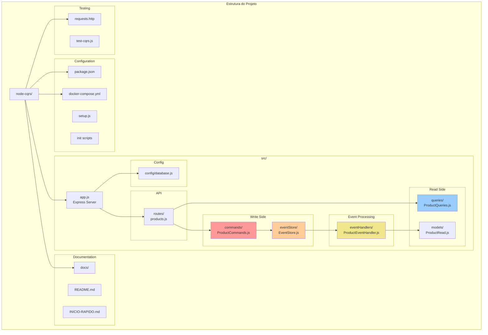

# Estrutura do Código

## Visão Geral

Este diagrama mostra a organização completa do código do projeto CQRS, demonstrando como os arquivos estão estruturados e suas responsabilidades.



## Estrutura Detalhada

```
node-cqrs/
├── 📦 package.json                 # Dependências e scripts NPM
├── 🐳 docker-compose.yml          # Configuração Docker completa
├── 🐳 docker-compose-simple.yml   # Docker sem autenticação
├── 🗄️ init-db.sql                 # Script inicialização PostgreSQL
├── 🗄️ mongo-init.js               # Script inicialização MongoDB
├── ⚙️ setup.js                    # Configuração completa
├── 🚀 quick-setup.js              # Configuração rápida
├── 🧪 test-cqrs.js                # Testes automatizados
├── 🌐 requests.http               # Testes HTTP (VS Code)
├── 📚 README.md                   # Documentação principal
├── 📖 INICIO-RAPIDO.md            # Guia de início rápido
├── 📁 docs/                       # Documentação completa
│   ├── README.md
│   ├── diagramas/
│   ├── guias/
│   └── exemplos/
└── 📁 src/                        # Código fonte
    ├── 🚀 app.js                  # Aplicação Express principal
    ├── 📁 config/
    │   └── database.js            # Configuração das bases
    ├── 📁 commands/               # Lado da Escrita (Write Side)
    │   └── ProductCommands.js     # Commands de produto
    ├── 📁 queries/                # Lado da Leitura (Read Side)
    │   └── ProductQueries.js      # Queries de produto
    ├── 📁 models/                 # Models do Read Side
    │   └── ProductRead.js         # Model MongoDB
    ├── 📁 eventStore/             # Event Sourcing
    │   └── EventStore.js          # Gerenciador de eventos
    ├── 📁 eventHandlers/          # Processamento de Eventos
    │   └── ProductEventHandler.js # Handler de eventos
    └── 📁 routes/                 # API REST
        └── products.js            # Rotas de produtos
```

## Arquivos Principais

### 1. Aplicação Principal

#### `src/app.js`
```javascript
const express = require('express');
const cors = require('cors');
const { connectDatabases } = require('./config/database');
const productRoutes = require('./routes/products');

const app = express();
const PORT = process.env.PORT || 3000;

// Middlewares
app.use(cors());
app.use(express.json());

// Rotas
app.get('/health', (req, res) => {
    res.json({ 
        status: 'OK', 
        timestamp: new Date().toISOString(),
        service: 'CQRS Node.js API'
    });
});

app.use('/api/products', productRoutes);

// Inicialização
async function startServer() {
    try {
        await connectDatabases();
        
        app.listen(PORT, () => {
            console.log(`🚀 Server running on port ${PORT}`);
            console.log(`📋 Health check: http://localhost:${PORT}/health`);
            console.log(`📦 Products API: http://localhost:${PORT}/api/products`);
        });
    } catch (error) {
        console.error('❌ Failed to start server:', error);
        process.exit(1);
    }
}

startServer();
```

**Responsabilidades**:
- Configuração do Express.js
- Middleware CORS e JSON
- Roteamento principal
- Inicialização das bases de dados
- Health check endpoint

### 2. Configuração de Banco de Dados

#### `src/config/database.js`
```javascript
const { Pool } = require('pg');
const mongoose = require('mongoose');

// Configuração PostgreSQL (Write DB)
const pgPool = new Pool({
    host: process.env.POSTGRES_HOST || 'localhost',
    port: process.env.POSTGRES_PORT || 5432,
    user: process.env.POSTGRES_USER || 'cqrs_user',
    password: process.env.POSTGRES_PASSWORD || 'cqrs_password',
    database: process.env.POSTGRES_DB || 'cqrs_write_db',
    max: 20,
    idleTimeoutMillis: 30000,
    connectionTimeoutMillis: 2000,
});

// Configuração MongoDB (Read DB)
const mongoUri = process.env.MONGODB_URI || 
    'mongodb://localhost:27017/cqrs_read_db';

async function connectDatabases() {
    try {
        // Conectar PostgreSQL
        await pgPool.connect();
        console.log('✅ PostgreSQL (Write DB) connected');
        
        // Conectar MongoDB
        await mongoose.connect(mongoUri, {
            useNewUrlParser: true,
            useUnifiedTopology: true
        });
        console.log('✅ MongoDB (Read DB) connected');
        
    } catch (error) {
        console.error('❌ Database connection failed:', error);
        throw error;
    }
}

module.exports = { pgPool, connectDatabases };
```

**Responsabilidades**:
- Configuração PostgreSQL (Write)
- Configuração MongoDB (Read)
- Pool de conexões
- Fallback e retry logic
- Variáveis de ambiente

### 3. Write Side (Commands)

#### `src/commands/ProductCommands.js`
```javascript
const Joi = require('joi');
const { v4: uuidv4 } = require('uuid');
const { pgPool } = require('../config/database');
const EventStore = require('../eventStore/EventStore');

// Schema de validação
const productSchema = Joi.object({
    name: Joi.string().min(1).max(100).required(),
    price: Joi.number().positive().precision(2).required(),
    stock: Joi.number().integer().min(0).required()
});

class ProductCommands {
    
    // Criar produto
    static async createProduct(productData) {
        // Validação
        const { error, value } = productSchema.validate(productData);
        if (error) {
            throw new Error(`Validation error: ${error.details[0].message}`);
        }
        
        const client = await pgPool.connect();
        
        try {
            await client.query('BEGIN');
            
            const productId = uuidv4();
            const product = {
                id: productId,
                ...value,
                createdAt: new Date(),
                updatedAt: new Date()
            };
            
            // Insert no PostgreSQL
            const insertQuery = `
                INSERT INTO products (id, name, price, stock, created_at, updated_at)
                VALUES ($1, $2, $3, $4, $5, $6)
                RETURNING *
            `;
            
            const result = await client.query(insertQuery, [
                product.id, product.name, product.price, 
                product.stock, product.createdAt, product.updatedAt
            ]);
            
            // Salvar evento
            const event = {
                eventType: 'ProductCreated',
                aggregateId: product.id,
                eventData: product,
                eventVersion: 1
            };
            
            await EventStore.saveEvent(event, client);
            
            await client.query('COMMIT');
            
            return result.rows[0];
            
        } catch (error) {
            await client.query('ROLLBACK');
            throw error;
        } finally {
            client.release();
        }
    }
    
    // Atualizar produto
    static async updateProduct(productId, updateData) {
        // Implementação similar...
    }
    
    // Deletar produto
    static async deleteProduct(productId) {
        // Implementação similar...
    }
}

module.exports = ProductCommands;
```

**Responsabilidades**:
- Validação de dados (Joi)
- Regras de negócio
- Transações ACID
- Integração com Event Store
- Tratamento de erros

### 4. Read Side (Queries)

#### `src/queries/ProductQueries.js`
```javascript
const ProductRead = require('../models/ProductRead');

class ProductQueries {
    
    // Listar produtos com filtros
    static async getAllProducts(params = {}) {
        const {
            page = 1,
            limit = 10,
            search,
            minPrice,
            maxPrice,
            inStock,
            sortBy = 'createdAt',
            sortOrder = 'desc'
        } = params;
        
        // Construir filtros
        const filters = { isActive: true };
        
        if (search) {
            filters.$text = { $search: search };
        }
        
        if (minPrice !== null || maxPrice !== null) {
            filters.price = {};
            if (minPrice !== null) filters.price.$gte = minPrice;
            if (maxPrice !== null) filters.price.$lte = maxPrice;
        }
        
        if (inStock) {
            filters.stock = { $gt: 0 };
        }
        
        // Paginação
        const skip = (page - 1) * limit;
        const sort = { [sortBy]: sortOrder === 'desc' ? -1 : 1 };
        
        // Executar queries em paralelo
        const [products, total] = await Promise.all([
            ProductRead.find(filters)
                      .sort(sort)
                      .skip(skip)
                      .limit(limit)
                      .lean(),
            ProductRead.countDocuments(filters)
        ]);
        
        // Calcular paginação
        const pagination = {
            page: parseInt(page),
            limit: parseInt(limit),
            total: parseInt(total),
            pages: Math.ceil(total / limit),
            hasNext: page < Math.ceil(total / limit),
            hasPrev: page > 1
        };
        
        return { products, pagination };
    }
    
    // Buscar produto por ID
    static async getProductById(productId) {
        const product = await ProductRead.findOne({ 
            productId, 
            isActive: true 
        }).lean();
        
        if (!product) {
            throw new Error('Product not found');
        }
        
        return product;
    }
}

module.exports = ProductQueries;
```

**Responsabilidades**:
- Queries otimizadas MongoDB
- Filtros dinâmicos
- Paginação eficiente
- Agregações e estatísticas
- Cache de consultas

### 5. Event Store

#### `src/eventStore/EventStore.js`
```javascript
const { v4: uuidv4 } = require('uuid');
const { pgPool } = require('../config/database');
const ProductEventHandler = require('../eventHandlers/ProductEventHandler');

class EventStore {
    
    // Salvar evento
    static async saveEvent(event, client = null) {
        const eventId = event.eventId || uuidv4();
        
        const query = `
            INSERT INTO events (
                event_id, event_type, aggregate_id, event_data, 
                event_version, timestamp
            )
            VALUES ($1, $2, $3, $4, $5, $6)
            RETURNING *
        `;
        
        const values = [
            eventId,
            event.eventType,
            event.aggregateId,
            JSON.stringify(event.eventData),
            event.eventVersion,
            event.timestamp || new Date()
        ];
        
        const result = await (client || pgPool).query(query, values);
        
        // Processar evento de forma assíncrona
        setImmediate(() => {
            this.processEventAsync({
                ...event,
                eventId,
                timestamp: result.rows[0].timestamp
            });
        });
        
        return result.rows[0];
    }
    
    // Processamento assíncrono
    static async processEventAsync(event) {
        try {
            await ProductEventHandler.processEvent(event);
        } catch (error) {
            console.error('❌ Error processing event:', error);
            // Implementar retry logic aqui
        }
    }
    
    // Obter eventos de um aggregate
    static async getEventsForAggregate(aggregateId) {
        const query = `
            SELECT * FROM events 
            WHERE aggregate_id = $1 
            ORDER BY event_version ASC
        `;
        
        const result = await pgPool.query(query, [aggregateId]);
        
        return result.rows.map(row => ({
            ...row,
            eventData: JSON.parse(row.event_data)
        }));
    }
    
    // Replay de eventos
    static async replayEvents(aggregateId) {
        const events = await this.getEventsForAggregate(aggregateId);
        
        let state = null;
        
        for (const event of events) {
            state = this.applyEvent(state, event);
        }
        
        return state;
    }
}

module.exports = EventStore;
```

**Responsabilidades**:
- Persistência de eventos
- Processamento assíncrono
- Replay de eventos
- Integridade de dados
- Auditoria completa

### 6. Event Handlers

#### `src/eventHandlers/ProductEventHandler.js`
```javascript
const ProductRead = require('../models/ProductRead');

class ProductEventHandler {
    
    static async processEvent(event) {
        console.log(`📨 Processing: ${event.eventType} for ${event.aggregateId}`);
        
        try {
            switch (event.eventType) {
                case 'ProductCreated':
                    await this.handleProductCreated(event);
                    break;
                    
                case 'ProductUpdated':
                    await this.handleProductUpdated(event);
                    break;
                    
                case 'ProductDeleted':
                    await this.handleProductDeleted(event);
                    break;
                    
                default:
                    console.warn(`⚠️ Unknown event: ${event.eventType}`);
            }
            
            console.log(`✅ Event processed: ${event.eventId}`);
            
        } catch (error) {
            console.error(`❌ Error processing event:`, error);
            throw error;
        }
    }
    
    static async handleProductCreated(event) {
        const productData = event.eventData;
        
        const productRead = new ProductRead({
            productId: event.aggregateId,
            name: productData.name,
            price: productData.price,
            stock: productData.stock,
            isActive: true,
            searchText: productData.name.toLowerCase(),
            priceRange: this.calculatePriceRange(productData.price),
            createdAt: productData.createdAt,
            updatedAt: productData.updatedAt
        });
        
        await productRead.save();
    }
    
    static calculatePriceRange(price) {
        if (price < 100) return 'low';
        if (price < 1000) return 'medium';
        return 'high';
    }
}

module.exports = ProductEventHandler;
```

**Responsabilidades**:
- Sincronização entre bases
- Processamento de eventos
- Atualização Read Model
- Enriquecimento de dados
- Error handling

### 7. API Routes

#### `src/routes/products.js`
```javascript
const express = require('express');
const ProductCommands = require('../commands/ProductCommands');
const ProductQueries = require('../queries/ProductQueries');
const EventStore = require('../eventStore/EventStore');

const router = express.Router();

// Commands (Write) - PostgreSQL
router.post('/', async (req, res) => {
    try {
        const result = await ProductCommands.createProduct(req.body);
        res.status(201).json({ success: true, data: result });
    } catch (error) {
        res.status(400).json({ success: false, error: error.message });
    }
});

// Queries (Read) - MongoDB
router.get('/', async (req, res) => {
    try {
        const queryParams = {
            page: parseInt(req.query.page) || 1,
            limit: parseInt(req.query.limit) || 10,
            search: req.query.search,
            minPrice: req.query.minPrice ? parseFloat(req.query.minPrice) : null,
            maxPrice: req.query.maxPrice ? parseFloat(req.query.maxPrice) : null,
            inStock: req.query.inStock === 'true',
            sortBy: req.query.sortBy || 'createdAt',
            sortOrder: req.query.sortOrder || 'desc'
        };
        
        const result = await ProductQueries.getAllProducts(queryParams);
        
        res.json({
            success: true,
            data: result.products,
            pagination: result.pagination
        });
    } catch (error) {
        res.status(500).json({ success: false, error: error.message });
    }
});

// Admin: Event Store
router.get('/events/:id', async (req, res) => {
    try {
        const events = await EventStore.getEventsForAggregate(req.params.id);
        res.json({ success: true, data: events });
    } catch (error) {
        res.status(500).json({ success: false, error: error.message });
    }
});

module.exports = router;
```

**Responsabilidades**:
- Roteamento HTTP
- Separação Commands/Queries
- Validação de parâmetros
- Tratamento de erros
- Formatação de respostas

## Padrões de Organização

### 1. Separação por Responsabilidade
- **Commands**: Modificam estado
- **Queries**: Consultam dados
- **Events**: Processam mudanças
- **Routes**: Interface HTTP

### 2. Layered Architecture
```
API Layer (routes/)
├── Application Layer (commands/, queries/)
├── Domain Layer (eventStore/, eventHandlers/)
└── Infrastructure Layer (config/, models/)
```

### 3. Dependency Direction
- API depende de Application
- Application depende de Domain
- Domain é independente
- Infrastructure é plugável

### 4. Configuration Management
- Environment variables
- Database connections
- Docker configurations
- Setup scripts

---

**Anterior**: [Event Store e Event Sourcing](./04-event-store.md) | **Próximo**: [Componentes Detalhados](./06-componentes-detalhados.md) 