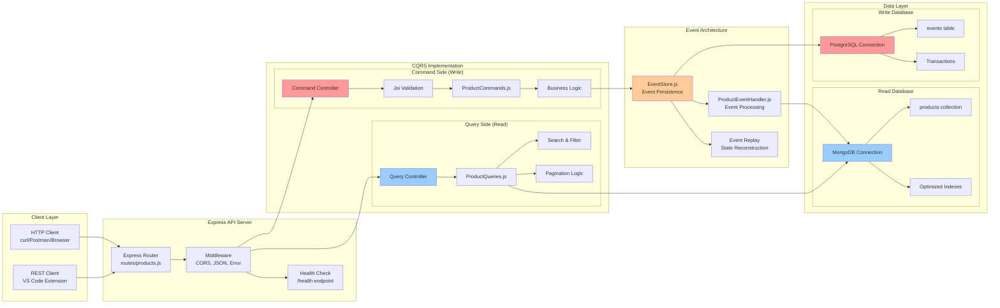

# Componentes Detalhados

## Visão Geral

Este diagrama apresenta uma visão detalhada de todos os componentes do sistema CQRS e suas interações, mostrando o fluxo completo de dados e processamento.



## Detalhamento dos Componentes

### 1. Client Layer (Camada Cliente)

#### HTTP Client
```javascript
// Exemplo usando curl
curl -X POST http://localhost:3000/api/products \
  -H "Content-Type: application/json" \
  -d '{"name": "Produto Teste", "price": 99.90, "stock": 10}'

// Exemplo usando fetch
const response = await fetch('/api/products', {
    method: 'POST',
    headers: { 'Content-Type': 'application/json' },
    body: JSON.stringify({
        name: 'Produto Teste',
        price: 99.90,
        stock: 10
    })
});
```

#### REST Client (VS Code)
```http
### Criar produto
POST http://localhost:3000/api/products
Content-Type: application/json

{
    "name": "Notebook Dell",
    "price": 2500.00,
    "stock": 15
}

### Listar produtos com filtros
GET http://localhost:3000/api/products?search=notebook&minPrice=1000&page=1&limit=5
```

**Responsabilidades**:
- Interface com usuário final
- Formatação de requisições HTTP
- Tratamento de respostas
- Validação lado cliente

### 2. Express API Server

#### Express Router
```javascript
// src/routes/products.js
const router = express.Router();

// Documentação automática
router.get('/docs', (req, res) => {
    res.json({
        endpoints: {
            "GET /": "Lista produtos com filtros",
            "GET /:id": "Busca produto por ID",
            "POST /": "Cria novo produto",
            "PUT /:id": "Atualiza produto",
            "DELETE /:id": "Remove produto",
            "GET /events/:id": "Lista eventos de um produto",
            "POST /admin/replay/:id": "Replay eventos"
        },
        examples: {
            create: { name: "Produto", price: 99.90, stock: 10 },
            filters: "?search=termo&minPrice=50&maxPrice=500&inStock=true&page=1&limit=10"
        }
    });
});
```

#### Middleware Stack
```javascript
// src/app.js
const app = express();

// 1. Logging Middleware
app.use((req, res, next) => {
    console.log(`${new Date().toISOString()} - ${req.method} ${req.path}`);
    next();
});

// 2. Security Middleware
app.use(cors({
    origin: process.env.ALLOWED_ORIGINS?.split(',') || '*',
    credentials: true
}));

// 3. Body Parser
app.use(express.json({ limit: '10mb' }));
app.use(express.urlencoded({ extended: true }));

// 4. Error Handling Middleware
app.use((error, req, res, next) => {
    console.error('❌ API Error:', error);
    
    if (error.name === 'ValidationError') {
        return res.status(400).json({
            success: false,
            error: 'Validation failed',
            details: error.message
        });
    }
    
    res.status(500).json({
        success: false,
        error: 'Internal server error'
    });
});
```

#### Health Check
```javascript
// Health endpoint com informações detalhadas
app.get('/health', async (req, res) => {
    try {
        // Verificar conexões
        const pgStatus = await checkPostgreSQLHealth();
        const mgStatus = await checkMongoDBHealth();
        
        const health = {
            status: 'OK',
            timestamp: new Date().toISOString(),
            service: 'CQRS Node.js API',
            version: process.env.npm_package_version || '1.0.0',
            uptime: process.uptime(),
            memory: process.memoryUsage(),
            databases: {
                postgresql: pgStatus,
                mongodb: mgStatus
            },
            environment: process.env.NODE_ENV || 'development'
        };
        
        const allHealthy = pgStatus.healthy && mgStatus.healthy;
        res.status(allHealthy ? 200 : 503).json(health);
        
    } catch (error) {
        res.status(503).json({
            status: 'ERROR',
            error: error.message
        });
    }
});
```

### 3. CQRS Implementation

#### Command Side (Write)

##### Command Controller
```javascript
// Dentro de src/routes/products.js
class CommandController {
    
    static async createProduct(req, res) {
        try {
            // 1. Validação de entrada
            const { body } = req;
            if (!body || Object.keys(body).length === 0) {
                return res.status(400).json({
                    success: false,
                    error: 'Request body is required'
                });
            }
            
            // 2. Executar command
            const result = await ProductCommands.createProduct(body);
            
            // 3. Log da operação
            console.log(`✅ Product created: ${result.id}`);
            
            // 4. Resposta de sucesso
            res.status(201).json({
                success: true,
                data: result,
                message: 'Product created successfully'
            });
            
        } catch (error) {
            console.error('❌ Create product error:', error);
            
            res.status(400).json({
                success: false,
                error: error.message,
                code: this.getErrorCode(error)
            });
        }
    }
    
    static getErrorCode(error) {
        if (error.message.includes('Validation')) return 'VALIDATION_ERROR';
        if (error.message.includes('duplicate')) return 'DUPLICATE_ERROR';
        return 'UNKNOWN_ERROR';
    }
}
```

##### Joi Validation
```javascript
// Schemas de validação avançados
const Joi = require('joi');

const productCreateSchema = Joi.object({
    name: Joi.string()
        .min(1)
        .max(100)
        .pattern(/^[a-zA-Z0-9\s\-_]+$/)
        .required()
        .messages({
            'string.pattern.base': 'Name can only contain letters, numbers, spaces, hyphens and underscores'
        }),
    
    price: Joi.number()
        .positive()
        .precision(2)
        .max(999999.99)
        .required()
        .messages({
            'number.positive': 'Price must be a positive number',
            'number.max': 'Price cannot exceed 999,999.99'
        }),
    
    stock: Joi.number()
        .integer()
        .min(0)
        .max(999999)
        .required()
        .messages({
            'number.min': 'Stock cannot be negative',
            'number.max': 'Stock cannot exceed 999,999'
        }),
    
    description: Joi.string()
        .max(500)
        .optional(),
    
    category: Joi.string()
        .valid('electronics', 'clothing', 'books', 'home', 'sports')
        .optional()
});

const productUpdateSchema = productCreateSchema.fork(
    ['name', 'price', 'stock'],
    (schema) => schema.optional()
);
```

#### Query Side (Read)

##### Query Controller
```javascript
class QueryController {
    
    static async getAllProducts(req, res) {
        try {
            // 1. Parseamento e validação de parâmetros
            const queryParams = this.parseQueryParams(req.query);
            
            // 2. Executar query
            const result = await ProductQueries.getAllProducts(queryParams);
            
            // 3. Formatação da resposta
            res.json({
                success: true,
                data: result.products,
                pagination: result.pagination,
                filters: queryParams,
                timestamp: new Date().toISOString()
            });
            
        } catch (error) {
            console.error('❌ Query products error:', error);
            
            res.status(500).json({
                success: false,
                error: error.message
            });
        }
    }
    
    static parseQueryParams(query) {
        return {
            page: Math.max(1, parseInt(query.page) || 1),
            limit: Math.min(100, Math.max(1, parseInt(query.limit) || 10)),
            search: query.search?.trim(),
            minPrice: query.minPrice ? parseFloat(query.minPrice) : null,
            maxPrice: query.maxPrice ? parseFloat(query.maxPrice) : null,
            inStock: query.inStock === 'true',
            category: query.category,
            sortBy: ['name', 'price', 'stock', 'createdAt'].includes(query.sortBy) 
                ? query.sortBy 
                : 'createdAt',
            sortOrder: query.sortOrder === 'asc' ? 'asc' : 'desc'
        };
    }
}
```

##### Search & Filter
```javascript
// Implementação avançada de busca
class ProductSearch {
    
    static buildMongoFilters(params) {
        const filters = { isActive: true };
        
        // Text search com score
        if (params.search) {
            filters.$text = { 
                $search: params.search,
                $caseSensitive: false
            };
        }
        
        // Price range
        if (params.minPrice !== null || params.maxPrice !== null) {
            filters.price = {};
            if (params.minPrice !== null) {
                filters.price.$gte = params.minPrice;
            }
            if (params.maxPrice !== null) {
                filters.price.$lte = params.maxPrice;
            }
        }
        
        // Stock filter
        if (params.inStock) {
            filters.stock = { $gt: 0 };
        }
        
        // Category filter
        if (params.category) {
            filters.category = params.category;
        }
        
        return filters;
    }
    
    static buildAggregationPipeline(filters, sortBy, sortOrder, skip, limit) {
        const pipeline = [
            { $match: filters }
        ];
        
        // Add text score for sorting if text search
        if (filters.$text) {
            pipeline.push({
                $addFields: { score: { $meta: "textScore" } }
            });
        }
        
        // Sorting
        const sortStage = {};
        if (filters.$text && sortBy === 'relevance') {
            sortStage.score = { $meta: "textScore" };
        } else {
            sortStage[sortBy] = sortOrder === 'desc' ? -1 : 1;
        }
        pipeline.push({ $sort: sortStage });
        
        // Pagination
        pipeline.push({ $skip: skip });
        pipeline.push({ $limit: limit });
        
        // Remove internal fields
        pipeline.push({
            $project: {
                score: 0,
                __v: 0
            }
        });
        
        return pipeline;
    }
}
```

### 4. Event Architecture

#### Event Store
```javascript
// Implementação robusta do Event Store
class EventStore {
    
    static async saveEvent(event, client = null) {
        // Validação do evento
        this.validateEvent(event);
        
        const eventId = event.eventId || uuidv4();
        const timestamp = new Date();
        
        const query = `
            INSERT INTO events (
                event_id, event_type, aggregate_id, event_data, 
                event_version, timestamp, metadata
            )
            VALUES ($1, $2, $3, $4, $5, $6, $7)
            RETURNING *
        `;
        
        const values = [
            eventId,
            event.eventType,
            event.aggregateId,
            JSON.stringify(event.eventData),
            event.eventVersion,
            timestamp,
            JSON.stringify(event.metadata || {})
        ];
        
        try {
            const result = await (client || pgPool).query(query, values);
            
            // Log do evento
            console.log(`📝 Event saved: ${event.eventType} for ${event.aggregateId}`);
            
            // Processar de forma assíncrona
            setImmediate(() => {
                this.processEventAsync({
                    ...event,
                    eventId,
                    timestamp
                });
            });
            
            return result.rows[0];
            
        } catch (error) {
            console.error('❌ Error saving event:', error);
            throw new Error(`Failed to save event: ${error.message}`);
        }
    }
    
    static validateEvent(event) {
        if (!event.eventType) {
            throw new Error('Event type is required');
        }
        if (!event.aggregateId) {
            throw new Error('Aggregate ID is required');
        }
        if (!event.eventData) {
            throw new Error('Event data is required');
        }
        if (!event.eventVersion || event.eventVersion < 1) {
            throw new Error('Event version must be a positive integer');
        }
    }
}
```

#### Event Processing
```javascript
// Sistema robusto de processamento de eventos
class EventProcessor {
    
    static async processEvent(event) {
        const startTime = Date.now();
        
        try {
            console.log(`🔄 Processing event: ${event.eventType}`);
            
            // Verificar se evento já foi processado (idempotência)
            const alreadyProcessed = await this.isEventProcessed(event.eventId);
            if (alreadyProcessed) {
                console.log(`⚠️ Event already processed: ${event.eventId}`);
                return;
            }
            
            // Processar baseado no tipo
            await this.routeEvent(event);
            
            // Marcar como processado
            await this.markEventAsProcessed(event.eventId);
            
            const duration = Date.now() - startTime;
            console.log(`✅ Event processed in ${duration}ms: ${event.eventId}`);
            
        } catch (error) {
            console.error(`❌ Error processing event ${event.eventId}:`, error);
            
            // Implementar retry com backoff
            await this.scheduleRetry(event, error);
        }
    }
    
    static async routeEvent(event) {
        switch (event.eventType) {
            case 'ProductCreated':
                await ProductEventHandler.handleProductCreated(event);
                break;
                
            case 'ProductUpdated':
                await ProductEventHandler.handleProductUpdated(event);
                break;
                
            case 'ProductDeleted':
                await ProductEventHandler.handleProductDeleted(event);
                break;
                
            default:
                console.warn(`⚠️ Unknown event type: ${event.eventType}`);
        }
    }
    
    static async scheduleRetry(event, error) {
        // Implementar retry com exponential backoff
        const retryCount = event.retryCount || 0;
        const maxRetries = 3;
        
        if (retryCount < maxRetries) {
            const delay = Math.pow(2, retryCount) * 1000; // 1s, 2s, 4s
            
            setTimeout(() => {
                this.processEvent({
                    ...event,
                    retryCount: retryCount + 1
                });
            }, delay);
            
            console.log(`🔄 Retry scheduled for event ${event.eventId} in ${delay}ms`);
        } else {
            console.error(`💀 Max retries exceeded for event ${event.eventId}`);
            // Enviar para dead letter queue ou alertas
        }
    }
}
```

### 5. Data Layer

#### PostgreSQL (Write Database)
```javascript
// Configuração avançada do PostgreSQL
class PostgreSQLManager {
    
    static createPool() {
        return new Pool({
            host: process.env.POSTGRES_HOST || 'localhost',
            port: process.env.POSTGRES_PORT || 5432,
            user: process.env.POSTGRES_USER || 'cqrs_user',
            password: process.env.POSTGRES_PASSWORD || 'cqrs_password',
            database: process.env.POSTGRES_DB || 'cqrs_write_db',
            
            // Pool configuration
            max: 20,                    // máximo de conexões
            min: 2,                     // mínimo de conexões
            idle: 10000,               // tempo idle em ms
            acquire: 60000,            // tempo para adquirir conexão
            evict: 1000,               // tempo para remoção de conexões idle
            
            // Retry configuration
            createRetryIntervalMillis: 200,
            createTimeoutMillis: 20000,
            
            // Logging
            log: (msg) => console.log('🐘 PostgreSQL:', msg)
        });
    }
    
    static async healthCheck() {
        try {
            const client = await pgPool.connect();
            const result = await client.query('SELECT NOW()');
            client.release();
            
            return {
                healthy: true,
                timestamp: result.rows[0].now,
                poolSize: pgPool.totalCount,
                idleConnections: pgPool.idleCount,
                waitingClients: pgPool.waitingCount
            };
        } catch (error) {
            return {
                healthy: false,
                error: error.message
            };
        }
    }
}
```

#### MongoDB (Read Database)
```javascript
// Configuração otimizada do MongoDB
class MongoDBManager {
    
    static getConnectionOptions() {
        return {
            useNewUrlParser: true,
            useUnifiedTopology: true,
            
            // Pool settings
            maxPoolSize: 20,
            minPoolSize: 2,
            maxIdleTimeMS: 30000,
            
            // Timeout settings
            serverSelectionTimeoutMS: 5000,
            socketTimeoutMS: 45000,
            connectTimeoutMS: 10000,
            
            // Retry settings
            retryWrites: true,
            retryReads: true,
            
            // Logging
            loggerLevel: 'info'
        };
    }
    
    static async createIndexes() {
        console.log('📊 Creating MongoDB indexes...');
        
        // Índices simples
        await ProductRead.collection.createIndex({ productId: 1 }, { unique: true });
        await ProductRead.collection.createIndex({ name: 1 });
        await ProductRead.collection.createIndex({ price: 1 });
        await ProductRead.collection.createIndex({ stock: 1 });
        await ProductRead.collection.createIndex({ isActive: 1 });
        await ProductRead.collection.createIndex({ createdAt: -1 });
        
        // Índices compostos
        await ProductRead.collection.createIndex({ 
            isActive: 1, 
            price: 1, 
            stock: 1 
        });
        
        // Índice de texto
        await ProductRead.collection.createIndex({ 
            name: 'text', 
            description: 'text' 
        }, {
            weights: { name: 10, description: 1 },
            name: 'product_text_index'
        });
        
        console.log('✅ MongoDB indexes created');
    }
    
    static async healthCheck() {
        try {
            const admin = mongoose.connection.db.admin();
            const result = await admin.ping();
            
            return {
                healthy: true,
                readyState: mongoose.connection.readyState,
                host: mongoose.connection.host,
                port: mongoose.connection.port,
                name: mongoose.connection.name
            };
        } catch (error) {
            return {
                healthy: false,
                error: error.message
            };
        }
    }
}
```

## Fluxos de Dados Detalhados

### 1. Command Flow (Write)
```
Cliente HTTP → Express Router → Middleware → Command Controller
    ↓
Validation (Joi) → Business Logic → PostgreSQL Transaction
    ↓
Event Store → Async Event Processing → MongoDB Sync
```

### 2. Query Flow (Read)
```
Cliente HTTP → Express Router → Query Controller → MongoDB
    ↓
Filtros + Paginação → Agregações → Resultado Formatado → Resposta
```

### 3. Event Flow
```
Command → Event Store (PostgreSQL) → Event Handler → Read Model (MongoDB)
    ↓
Retry Logic ← Error Handling ← Processing
```

## Métricas e Monitoramento

### Performance Metrics
```javascript
// Coleta de métricas
class MetricsCollector {
    
    static trackCommandExecution(commandType, duration, success) {
        console.log(`📊 Command ${commandType}: ${duration}ms ${success ? '✅' : '❌'}`);
        
        // Aqui integraria com Prometheus, DataDog, etc.
        this.incrementCounter(`command_${commandType}_total`);
        this.observeHistogram(`command_${commandType}_duration`, duration);
        
        if (!success) {
            this.incrementCounter(`command_${commandType}_errors`);
        }
    }
    
    static trackQueryExecution(queryType, resultCount, duration) {
        console.log(`📊 Query ${queryType}: ${resultCount} results in ${duration}ms`);
        
        this.observeHistogram(`query_${queryType}_duration`, duration);
        this.observeHistogram(`query_${queryType}_results`, resultCount);
    }
    
    static trackEventProcessing(eventType, duration, success) {
        console.log(`📊 Event ${eventType}: ${duration}ms ${success ? '✅' : '❌'}`);
        
        this.observeHistogram(`event_${eventType}_processing_duration`, duration);
        
        if (!success) {
            this.incrementCounter(`event_${eventType}_processing_errors`);
        }
    }
}
```

---

**Anterior**: [Estrutura do Código](./05-estrutura-codigo.md) | **Próximo**: [Guias](../guias/como-funciona-cqrs.md) 