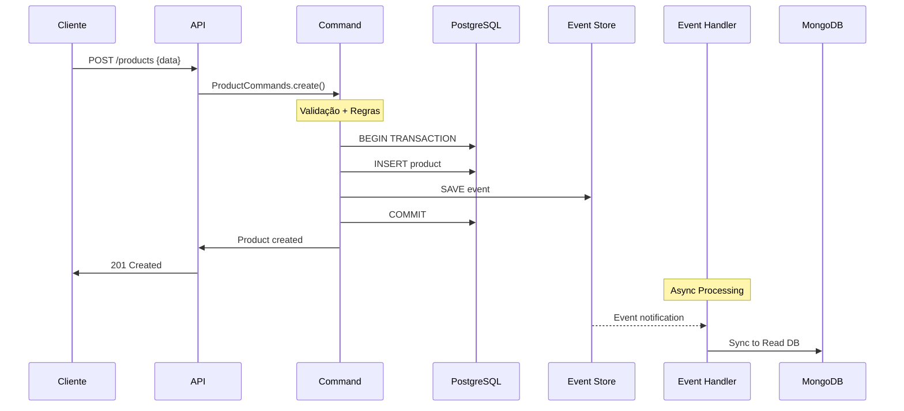
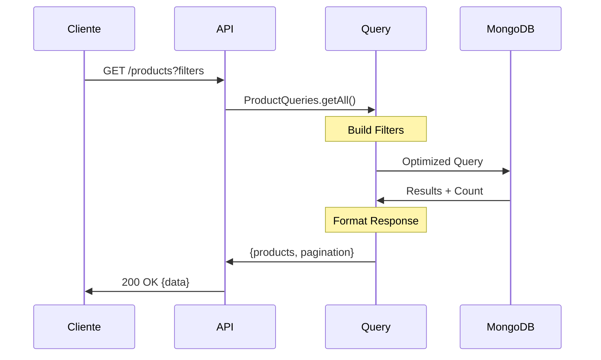

# Como Funciona o CQRS

## Introdução

**CQRS (Command Query Responsibility Segregation)** é um padrão arquitetural que separa operações de **leitura** (queries) das operações de **escrita** (commands). Esta separação permite otimizações específicas para cada tipo de operação.

## Conceitos Fundamentais

### 1. Separação de Responsabilidades

#### Commands (Comandos)
- **Propósito**: Modificar o estado do sistema
- **Operações**: CREATE, UPDATE, DELETE
- **Características**: 
  - Validação rigorosa
  - Regras de negócio
  - Transações ACID
  - Retorna confirmação, não dados

#### Queries (Consultas)
- **Propósito**: Recuperar dados do sistema
- **Operações**: READ, SEARCH, FILTER
- **Características**:
  - Otimizadas para performance
  - Sem efeitos colaterais
  - Podem usar cache
  - Retorna dados formatados

### 2. Modelo Tradicional vs CQRS

#### Arquitetura Tradicional (CRUD)
```
Cliente → API → Lógica de Negócio → Banco de Dados Único
```

**Problemas**:
- Performance limitada
- Conflito entre leitura e escrita
- Dificuldade para escalar
- Modelo de dados rígido

#### Arquitetura CQRS
```
Cliente → API → Commands → Write Database (PostgreSQL)
              → Queries  → Read Database (MongoDB)
```

**Benefícios**:
- Otimização específica para cada lado
- Escalabilidade independente
- Flexibilidade de modelos de dados
- Performance superior

## Implementação no Projeto

### 1. Write Side (Escrita)

#### Estrutura
```javascript
// src/commands/ProductCommands.js
class ProductCommands {
    static async createProduct(productData) {
        // 1. Validação
        const { error, value } = productSchema.validate(productData);
        
        // 2. Regras de negócio
        if (value.price < 0) {
            throw new Error('Price cannot be negative');
        }
        
        // 3. Persistência com transação
        const client = await pgPool.connect();
        try {
            await client.query('BEGIN');
            
            // Insert na tabela principal
            const product = await this.insertProduct(value, client);
            
            // Salvar evento
            await EventStore.saveEvent({
                eventType: 'ProductCreated',
                aggregateId: product.id,
                eventData: product
            }, client);
            
            await client.query('COMMIT');
            return product;
            
        } catch (error) {
            await client.query('ROLLBACK');
            throw error;
        }
    }
}
```

#### Características do Write Side
- **Base de Dados**: PostgreSQL (ACID)
- **Foco**: Consistência e integridade
- **Transações**: Suporte completo
- **Validação**: Rigorosa
- **Performance**: Otimizada para escrita

### 2. Read Side (Leitura)

#### Estrutura
```javascript
// src/queries/ProductQueries.js
class ProductQueries {
    static async getAllProducts(filters) {
        // Query otimizada com índices
        const query = ProductRead.find(filters)
            .sort({ createdAt: -1 })
            .limit(filters.limit)
            .skip(filters.skip)
            .lean(); // Performance: objetos JS simples
        
        // Executar em paralelo
        const [products, total] = await Promise.all([
            query,
            ProductRead.countDocuments(filters)
        ]);
        
        return {
            products,
            pagination: this.calculatePagination(filters, total)
        };
    }
}
```

#### Características do Read Side
- **Base de Dados**: MongoDB (Flexível)
- **Foco**: Performance de consulta
- **Desnormalização**: Dados otimizados
- **Índices**: Específicos para consultas
- **Cache**: Estratégias avançadas

### 3. Sincronização entre Lados

#### Event-Driven Sync
```javascript
// src/eventHandlers/ProductEventHandler.js
class ProductEventHandler {
    static async handleProductCreated(event) {
        // Dados do Write Side
        const productData = event.eventData;
        
        // Criar registro otimizado para Read Side
        const productRead = new ProductRead({
            productId: event.aggregateId,
            
            // Dados básicos
            name: productData.name,
            price: productData.price,
            stock: productData.stock,
            
            // Campos otimizados para busca
            searchText: productData.name.toLowerCase(),
            priceRange: this.calculatePriceRange(productData.price),
            
            // Timestamps
            createdAt: productData.createdAt,
            updatedAt: productData.updatedAt
        });
        
        await productRead.save();
    }
}
```

## Fluxos Detalhados

### 1. Fluxo de Command (Escrita)



**Passos Detalhados**:

1. **Requisição**: Cliente envia dados para criar produto
2. **Validação**: Joi valida formato e regras básicas
3. **Regras de Negócio**: Validações específicas do domínio
4. **Transação**: PostgreSQL garante consistência ACID
5. **Event Store**: Salva evento na mesma transação
6. **Resposta**: Cliente recebe confirmação imediata
7. **Processamento Assíncrono**: Event Handler sincroniza com Read DB

### 2. Fluxo de Query (Leitura)



**Passos Detalhados**:

1. **Requisição**: Cliente solicita lista de produtos com filtros
2. **Parse**: API converte query params em filtros estruturados
3. **Query Builder**: Constrói filtros MongoDB otimizados
4. **Execução**: MongoDB executa query com índices
5. **Paginação**: Calcula informações de paginação
6. **Formatação**: Estrutura resposta padronizada
7. **Resposta**: Cliente recebe dados formatados

## Vantagens do CQRS

### 1. Performance

#### Write Performance
- Transações otimizadas
- Menos contenção de locks
- Validações específicas
- Índices de escrita

#### Read Performance
- Queries especializadas
- Desnormalização estratégica
- Índices de leitura
- Cache agressivo

### 2. Escalabilidade

#### Escala Independente
```
Write Side: 2 instâncias PostgreSQL
Read Side: 5 instâncias MongoDB (réplicas)
```

#### Distribuição de Carga
- Commands: Menor volume, maior processamento
- Queries: Maior volume, menor processamento

### 3. Flexibilidade

#### Múltiplas Views
```javascript
// Diferentes projeções dos mesmos dados
class ProductViews {
    // View para listagem
    static async getListView() {
        return ProductRead.find()
            .select('name price stock')
            .lean();
    }
    
    // View para detalhes
    static async getDetailView(id) {
        return ProductRead.findOne({ productId: id })
            .populate('category')
            .populate('reviews');
    }
    
    // View para analytics
    static async getAnalyticsView() {
        return ProductRead.aggregate([
            { $group: { 
                _id: '$category', 
                avgPrice: { $avg: '$price' },
                totalStock: { $sum: '$stock' }
            }}
        ]);
    }
}
```

#### Evolução Independente
- Write model pode evoluir sem afetar Read
- Read model pode ser reconstruído
- Múltiplas versões podem coexistir

## Desafios e Soluções

### 1. Consistência Eventual

#### Problema
```
Cliente cria produto → Sucesso imediato
Cliente busca produto → Pode não aparecer ainda
```

#### Soluções
```javascript
// 1. Read from Write DB quando necessário
if (justCreated && !foundInReadDb) {
    return await this.readFromWriteDb(id);
}

// 2. Verificação de sincronização
if (event.timestamp > lastSyncTime) {
    await this.waitForSync(event.aggregateId);
}

// 3. UI otimista
// Mostra item criado imediatamente na UI
// Confirma quando sincronizado
```

### 2. Complexidade Adicional

#### Código Duplicado
- Diferentes models para Read/Write
- Lógica de sincronização
- Manutenção de múltiplas bases

#### Soluções
- Event Sourcing para rastreabilidade
- Generators para reduzir duplicação
- Testes automatizados robustos

### 3. Sincronização Falha

#### Detecção
```javascript
// Health check de sincronização
static async checkSyncHealth() {
    const lastEvent = await EventStore.getLastEvent();
    const lastSync = await this.getLastSyncTimestamp();
    
    const lag = lastEvent.timestamp - lastSync;
    
    if (lag > MAX_SYNC_LAG) {
        await this.triggerResync();
    }
}
```

#### Recovery
```javascript
// Replay automático em caso de falha
static async recoverFromSyncFailure(fromTimestamp) {
    const events = await EventStore.getEventsSince(fromTimestamp);
    
    for (const event of events) {
        await ProductEventHandler.processEvent(event);
    }
}
```

## Quando Usar CQRS

### ✅ Cenários Ideais

1. **Alta diferença entre Read/Write**
   - 90% leitura, 10% escrita
   - Queries complexas vs Commands simples

2. **Requisitos de Performance**
   - Latência crítica em consultas
   - Alto volume de dados

3. **Domínio Complexo**
   - Regras de negócio elaboradas
   - Múltiplas views dos dados

4. **Escalabilidade Necessária**
   - Crescimento desigual entre leitura/escrita
   - Distribuição geográfica

### ❌ Cenários a Evitar

1. **CRUD Simples**
   - Operações básicas apenas
   - Pouco volume de dados

2. **Equipe Pequena**
   - Falta de expertise
   - Recursos limitados

3. **Consistência Forte Requerida**
   - Transações complexas
   - Dados financeiros críticos

## Conclusão

CQRS é um padrão poderoso que oferece:

- **Performance Superior** através de otimizações específicas
- **Escalabilidade Flexível** com crescimento independente
- **Flexibilidade de Dados** com múltiplas projeções
- **Manutenibilidade** através da separação de responsabilidades

No entanto, adiciona complexidade que deve ser justificada pelos benefícios. Este projeto demonstra uma implementação completa e funcional do padrão CQRS com Event Sourcing em Node.js.

---

**Próximo**: [Event Sourcing Explicado](./event-sourcing.md) 