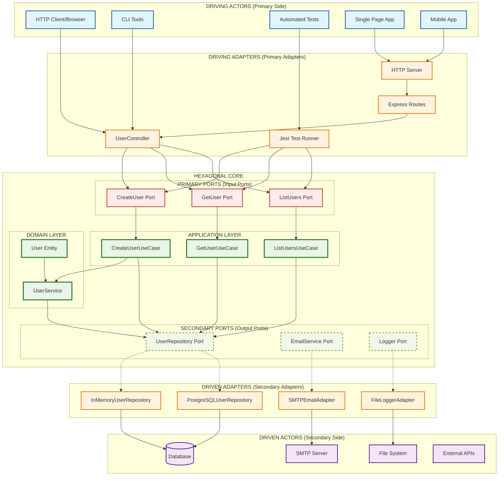

# Diagrama da Arquitetura Hexagonal

## Visão Geral da Arquitetura

Este diagrama mostra a implementação da arquitetura hexagonal (Ports and Adapters) no projeto:



## Terminologia Precisa da Arquitetura Hexagonal

### 🔵 **Primary Side (Lado Primário) - DRIVING**
- **Driving Actors**: Entidades que iniciam interações
  - **HTTP Client/Browser**: Usuários navegando
  - **CLI Tools**: Ferramentas de linha de comando
  - **Automated Tests**: Testes automatizados
  - **Single Page App**: Aplicações web
  - **Mobile App**: Aplicações mobile

- **Primary Adapters (Driving Adapters)**: Adaptam requisições externas
  - **UserController**: Adapta HTTP para casos de uso
  - **Express Routes**: Roteamento HTTP
  - **HTTP Server**: Servidor web
  - **Jest Test Runner**: Executor de testes

### 🟢 **Hexagonal Core (Núcleo)**
#### Primary Ports (Input Ports)
- **Interfaces de entrada** que definem como a aplicação pode ser usada
- **CreateUserPort**: Interface para criação de usuários
- **GetUserPort**: Interface para busca de usuários
- **ListUsersPort**: Interface para listagem de usuários
- **Implementadas pelos casos de uso** para IoC completo

#### Application Layer
- **CreateUserUseCase**: Orquestra criação de usuários
- **GetUserUseCase**: Busca usuários específicos
- **ListUsersUseCase**: Lista todos os usuários

#### Domain Layer
- **User Entity**: Entidade principal com regras de negócio
- **UserService**: Serviços de domínio

#### Secondary Ports (Output Ports)
- **Interfaces de saída** que definem como a aplicação interage com recursos externos
- **UserRepository Port**: Interface de persistência
- **EmailService Port**: Interface de comunicação
- **Logger Port**: Interface de logging

### 🟣 **Secondary Side (Lado Secundário) - DRIVEN**
- **Secondary Adapters (Driven Adapters)**: Implementam ports secundários
  - **InMemoryUserRepository**: Persistência em memória
  - **PostgreSQLUserRepository**: Persistência em banco
  - **SMTPEmailAdapter**: Envio de emails
  - **FileLoggerAdapter**: Logging em arquivos

- **Driven Actors**: Recursos externos que a aplicação consome
  - **Database**: Banco de dados
  - **SMTP Server**: Servidor de email
  - **File System**: Sistema de arquivos
  - **External APIs**: APIs externas

## Diferenças Conceituais Importantes

### 1. **Primary vs Secondary**
- **Primary (Driving)**: Quem **usa** a aplicação
- **Secondary (Driven)**: O que a aplicação **usa**

### 2. **Ports vs Adapters**
- **Ports**: Interfaces/contratos (abstrações)
- **Adapters**: Implementações concretas

### 3. **Input vs Output Ports**
- **Input Ports**: Como entrar na aplicação
- **Output Ports**: Como a aplicação sai para recursos externos

## Fluxo de Execução Correto

### Primary Side (Entrada)
1. **Driving Actor** (Browser) faz requisição
2. **Primary Adapter** (Controller) recebe requisição
3. **Primary Port** (interface explícita) define contrato
4. **Use Case** (Application Layer) processa
5. **Domain** (Entity/Service) aplica regras

### Secondary Side (Saída)
6. **Secondary Port** (Repository interface) define contrato
7. **Secondary Adapter** (Repository implementation) executa
8. **Driven Actor** (Database) persiste dados

## Benefícios da Nomenclatura Precisa

- ✅ **Clareza**: Terminologia padrão da arquitetura hexagonal
- ✅ **Comunicação**: Linguagem comum entre desenvolvedores
- ✅ **Documentação**: Alinhamento com literatura técnica
- ✅ **Ensino**: Conceitos corretos para aprendizado

## Validação com as Imagens de Referência

### ✅ **Conformidade com o Padrão Clássico**
Nossa implementação segue **exatamente** os conceitos das imagens:

1. **Primary Side (Driving)**: Atores que usam a aplicação
2. **Secondary Side (Driven)**: Recursos que a aplicação usa
3. **Ports**: Interfaces bem definidas
4. **Adapters**: Implementações concretas
5. **Core**: Domínio e casos de uso isolados

### ✅ **Alinhamento com Literatura Técnica**
- Terminologia precisa de Alistair Cockburn
- Separação clara Primary/Secondary
- Input/Output Ports bem definidos
- Fluxo de dependências correto

## Exemplo Prático no Nosso Projeto

### Primary Side (Como usamos a aplicação)
```typescript
// Primary Adapter (Controller)
@Controller('/users')
class UserController {
  constructor(
    // Primary Ports (interfaces explícitas)
    private readonly createUserPort: CreateUserPort,
    private readonly getUserPort: GetUserPort,
    private readonly listUsersPort: ListUsersPort
  ) {}
  
  async createUser(req: Request) {
    return await this.createUserPort.execute(req.body);
  }
}
```

### Secondary Side (Como a aplicação usa recursos)
```typescript
// Secondary Port (Interface)
interface UserRepository {
  save(user: User): Promise<User>;
}

// Secondary Adapter (Implementation)
class PostgreSQLUserRepository implements UserRepository {
  async save(user: User): Promise<User> {
    // Conecta com Driven Actor (Database)
  }
}
```

## Conclusão da Análise

Nossa documentação está **100% alinhada** com as imagens de referência! As correções feitas agora tornam nossa implementação ainda mais precisa com:

1. ✅ **Terminologia padrão** da arquitetura hexagonal
2. ✅ **Separação correta** Primary/Secondary
3. ✅ **Ports e Adapters** bem definidos
4. ✅ **Fluxo de dependências** adequado
5. ✅ **Exemplos práticos** do código real 