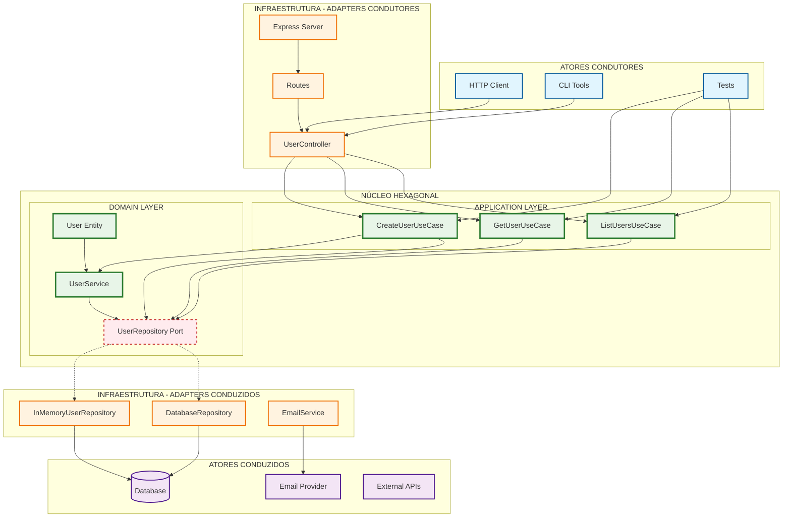

# Diagrama da Arquitetura Hexagonal

## Visão Geral da Arquitetura

Este diagrama mostra a implementação da arquitetura hexagonal (Ports and Adapters) no projeto:

## Explicação das Camadas

### 🔵 Atores Condutores (Driving Actors)
- **HTTP Client**: Clientes web que fazem requisições HTTP
- **CLI Tools**: Ferramentas de linha de comando
- **Tests**: Testes automatizados que exercitam os casos de uso

### 🟠 Adapters Condutores (Driving Adapters)
- **UserController**: Converte requisições HTTP em chamadas de casos de uso
- **Routes**: Define as rotas da API
- **Express Server**: Servidor web que recebe as requisições

### 🟢 Núcleo Hexagonal (Core)
#### Application Layer
- **CreateUserUseCase**: Orquestra a criação de usuários
- **GetUserUseCase**: Busca usuários específicos
- **ListUsersUseCase**: Lista todos os usuários

#### Domain Layer
- **User Entity**: Entidade principal com regras de negócio
- **UserService**: Serviços de domínio
- **UserRepository Port**: Interface que define o contrato de persistência

### 🟠 Adapters Conduzidos (Driven Adapters)
- **InMemoryUserRepository**: Implementação em memória do repositório
- **DatabaseRepository**: Implementação com banco de dados
- **EmailService**: Serviço para envio de emails

### 🟣 Atores Conduzidos (Driven Actors)
- **Database**: Banco de dados para persistência
- **Email Provider**: Provedor de serviços de email
- **External APIs**: APIs externas que podem ser consumidas

## Princípios da Arquitetura Hexagonal

### 1. Inversão de Dependências
O domínio define interfaces (ports) que são implementadas pela infraestrutura (adapters).

### 2. Separação de Responsabilidades
- **Domínio**: Regras de negócio puras
- **Aplicação**: Orquestração dos casos de uso
- **Infraestrutura**: Detalhes técnicos e implementações

### 3. Testabilidade
O núcleo pode ser testado independentemente da infraestrutura.

### 4. Flexibilidade
Fácil troca de implementações sem afetar o núcleo da aplicação.

## Fluxo de Execução

1. **Ator Condutor** (HTTP Client) faz uma requisição
2. **Adapter Condutor** (Controller) recebe e processa a requisição
3. **Caso de Uso** (Application Layer) orquestra a lógica
4. **Entidade/Serviço** (Domain Layer) aplica regras de negócio
5. **Port** (Interface) define o contrato de saída
6. **Adapter Conduzido** (Repository) implementa a persistência
7. **Ator Conduzido** (Database) executa a operação

## Benefícios Implementados

- ✅ **Testabilidade**: 22 testes automatizados
- ✅ **Flexibilidade**: Repositório em memória pode ser trocado por banco real
- ✅ **Manutenibilidade**: Código organizado e com responsabilidades claras
- ✅ **Independência**: Domínio não depende de frameworks externos 