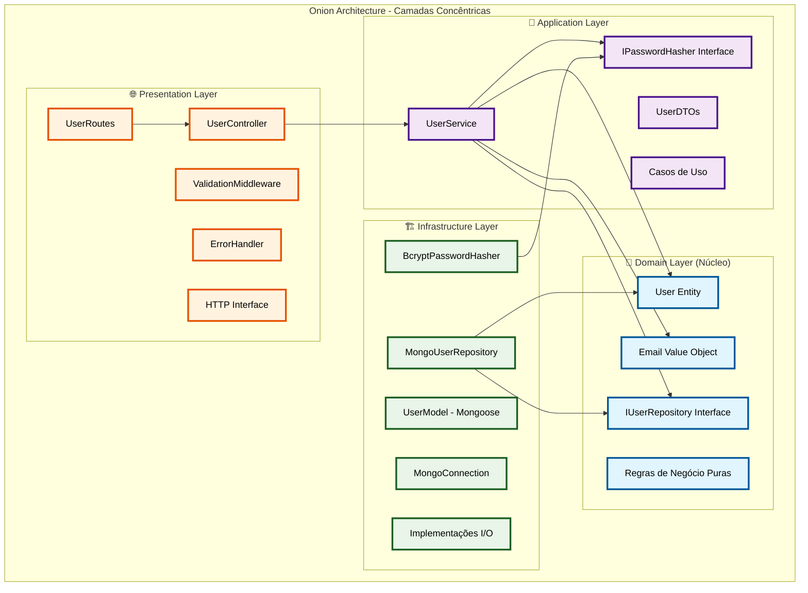

# Diagrama das Camadas - Onion Architecture

Este diagrama mostra a estrutura das camadas concêntricas da arquitetura Onion implementada no projeto.

```mermaid
graph TB
    subgraph "Onion Architecture - Camadas Concêntricas"
        subgraph "🎯 Domain Layer (Núcleo)"
            D1[User Entity]
            D2[Email Value Object]
            D3[IUserRepository Interface]
            D4[Regras de Negócio Puras]
        end
        
        subgraph "🔄 Application Layer"
            A1[UserService]
            A2[IPasswordHasher Interface]
            A3[UserDTOs]
            A4[Casos de Uso]
        end
        
        subgraph "🏗️ Infrastructure Layer"
            I1[MongoUserRepository]
            I2[BcryptPasswordHasher]
            I3[UserModel - Mongoose]
            I4[MongoConnection]
            I5[Implementações I/O]
        end
        
        subgraph "🌐 Presentation Layer"
            P1[UserController]
            P2[UserRoutes]
            P3[ValidationMiddleware]
            P4[ErrorHandler]
            P5[HTTP Interface]
        end
    end
    
    %% Dependências - Setas apontam para onde as dependências fluem
    A1 --> D1
    A1 --> D2
    A1 --> D3
    A1 --> A2
    
    I1 --> D3
    I1 --> D1
    I2 --> A2
    
    P1 --> A1
    P2 --> P1
    
    %% Estilos das camadas
    classDef domainStyle fill:#e1f5fe,stroke:#01579b,stroke-width:3px,color:#000
    classDef applicationStyle fill:#f3e5f5,stroke:#4a148c,stroke-width:3px,color:#000
    classDef infrastructureStyle fill:#e8f5e8,stroke:#1b5e20,stroke-width:3px,color:#000
    classDef presentationStyle fill:#fff3e0,stroke:#e65100,stroke-width:3px,color:#000
    
    class D1,D2,D3,D4 domainStyle
    class A1,A2,A3,A4 applicationStyle
    class I1,I2,I3,I4,I5 infrastructureStyle
    class P1,P2,P3,P4,P5 presentationStyle
```

