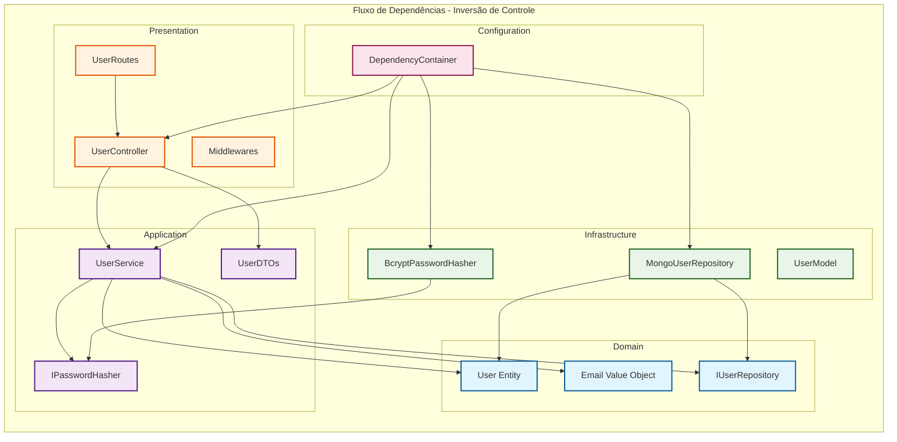

# Diagrama de Fluxo de Dependências

Este diagrama demonstra como as dependências fluem através das camadas da arquitetura Onion.

```mermaid
graph LR
    subgraph "Fluxo de Dependências - Inversão de Controle"
        subgraph "Domain"
            User[User Entity]
            Email[Email Value Object]
            IUserRepo[IUserRepository]
        end
        
        subgraph "Application"
            UserService[UserService]
            IPasswordHasher[IPasswordHasher]
            DTOs[UserDTOs]
        end
        
        subgraph "Infrastructure"
            MongoRepo[MongoUserRepository]
            BcryptHasher[BcryptPasswordHasher]
            UserModel[UserModel]
        end
        
        subgraph "Presentation"
            Controller[UserController]
            Routes[UserRoutes]
            Middleware[Middlewares]
        end
        
        subgraph "Configuration"
            DI[DependencyContainer]
        end
    end
    
    %% Dependências de Application para Domain
    UserService --> User
    UserService --> Email
    UserService --> IUserRepo
    UserService --> IPasswordHasher
    
    %% Dependências de Infrastructure para Domain/Application
    MongoRepo --> IUserRepo
    MongoRepo --> User
    BcryptHasher --> IPasswordHasher
    
    %% Dependências de Presentation para Application
    Controller --> UserService
    Controller --> DTOs
    Routes --> Controller
    
    %% Injeção de Dependências
    DI --> UserService
    DI --> MongoRepo
    DI --> BcryptHasher
    DI --> Controller
    
    %% Estilos
    classDef domain fill:#e1f5fe,stroke:#01579b,stroke-width:2px
    classDef application fill:#f3e5f5,stroke:#4a148c,stroke-width:2px
    classDef infrastructure fill:#e8f5e8,stroke:#1b5e20,stroke-width:2px
    classDef presentation fill:#fff3e0,stroke:#e65100,stroke-width:2px
    classDef config fill:#fce4ec,stroke:#880e4f,stroke-width:2px
    
    class User,Email,IUserRepo domain
    class UserService,IPasswordHasher,DTOs application
    class MongoRepo,BcryptHasher,UserModel infrastructure
    class Controller,Routes,Middleware presentation
    class DI config
```
