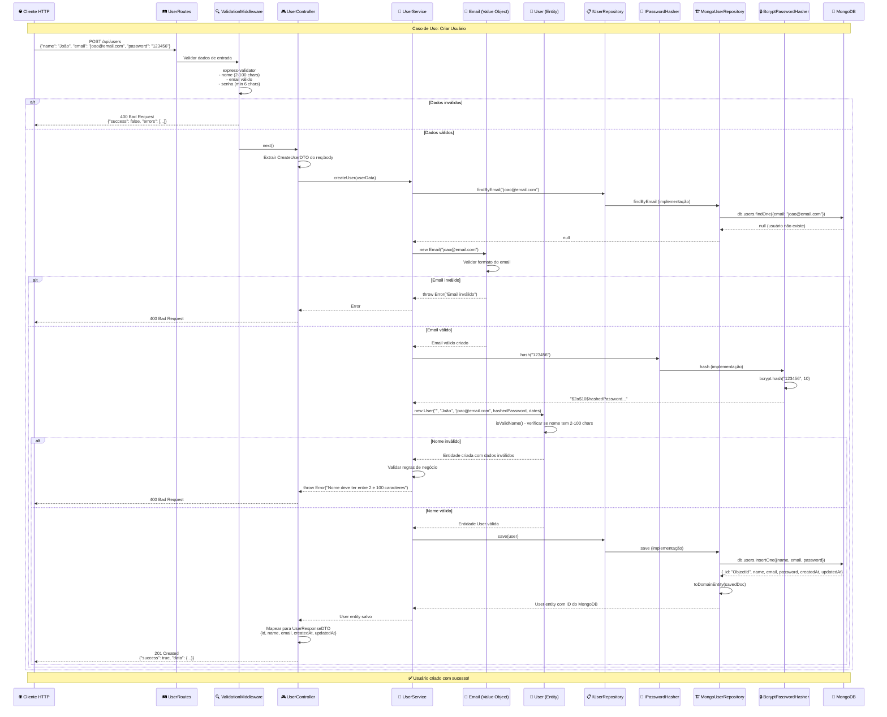

# Diagrama de Fluxo de Caso de Uso

Este diagrama mostra como uma requisição HTTP flui através de todas as camadas da arquitetura Onion.



## Camadas e Responsabilidades no Fluxo

### 🌐 **Presentation Layer**
- **Entrada**: Dados HTTP brutos
- **Responsabilidade**: Validação de formato, serialização
- **Saída**: DTOs para Application Layer

### 🔄 **Application Layer** 
- **Entrada**: DTOs validados
- **Responsabilidade**: Orquestração do caso de uso
- **Saída**: Entidades Domain para Infrastructure

### 🎯 **Domain Layer**
- **Entrada**: Dados para criar entidades
- **Responsabilidade**: Regras de negócio e validações
- **Saída**: Entidades válidas

### 🏗️ **Infrastructure Layer**
- **Entrada**: Entidades Domain
- **Responsabilidade**: Persistência e operações I/O
- **Saída**: Entidades persistidas

## Pontos de Validação

### 1️⃣ **Validation Middleware (Presentation)**
```typescript
// Validação de formato HTTP
body('name').isLength({ min: 2, max: 100 })
body('email').isEmail()
body('password').isLength({ min: 6 })
```

### 2️⃣ **Value Objects (Domain)**
```typescript
// Validação de regras de domínio
constructor(email: string) {
  if (!this.isValid(email)) {
    throw new Error('Email inválido');
  }
}
```

### 3️⃣ **Entities (Domain)**
```typescript
// Validação de regras de negócio
public isValidName(): boolean {
  return this.name.length >= 2 && this.name.length <= 100;
}
```

### 4️⃣ **Business Logic (Application)**
```typescript
// Validação de regras de aplicação
const existingUser = await this.userRepository.findByEmail(userData.email);
if (existingUser) {
  throw new Error('Email já está em uso');
}
```

## Tratamento de Erros

Erros podem ocorrer em qualquer camada e são propagados até a Presentation:

```
Domain Error → Application → Presentation → HTTP Response
Infrastructure Error → Application → Presentation → HTTP Response
Validation Error → Presentation → HTTP Response
``` 