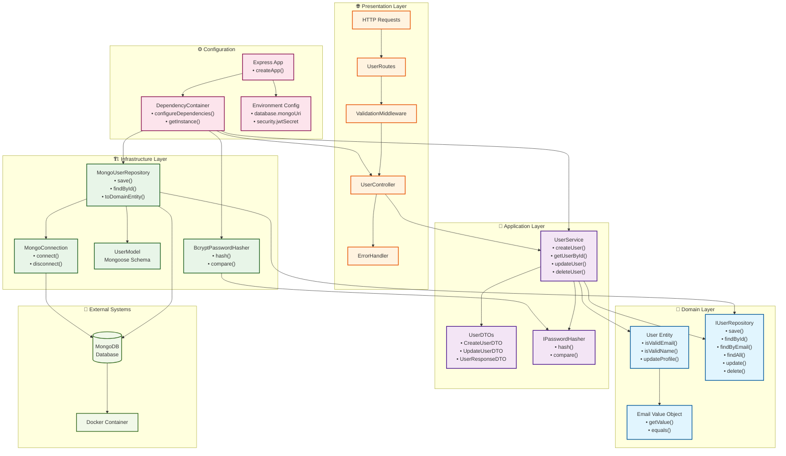

# Diagrama de Componentes

Este diagrama mostra a estrutura de componentes e suas relações na arquitetura Onion.

```mermaid
graph TB
    subgraph "🌐 Presentation Layer"
        HTTP[HTTP Requests]
        Routes[UserRoutes]
        Controller[UserController]
        ValidMW[ValidationMiddleware]
        ErrorMW[ErrorHandler]
        
        HTTP --> Routes
        Routes --> ValidMW
        ValidMW --> Controller
        Controller --> ErrorMW
    end
    
    subgraph "🔄 Application Layer"
        UserService["UserService<br/>• createUser()<br/>• getUserById()<br/>• updateUser()<br/>• deleteUser()"]
        DTOs["UserDTOs<br/>• CreateUserDTO<br/>• UpdateUserDTO<br/>• UserResponseDTO"]
        IPasswordHasher["IPasswordHasher<br/>• hash()<br/>• compare()"]
        
        UserService --> DTOs
        UserService --> IPasswordHasher
    end
    
    subgraph "🎯 Domain Layer"
        User["User Entity<br/>• isValidEmail()<br/>• isValidName()<br/>• updateProfile()"]
        Email["Email Value Object<br/>• getValue()<br/>• equals()"]
        IUserRepo["IUserRepository<br/>• save()<br/>• findById()<br/>• findByEmail()<br/>• findAll()<br/>• update()<br/>• delete()"]
        
        User --> Email
    end
    
    subgraph "🏗️ Infrastructure Layer"
        MongoRepo["MongoUserRepository<br/>• save()<br/>• findById()<br/>• toDomainEntity()"]
        BcryptHasher["BcryptPasswordHasher<br/>• hash()<br/>• compare()"]
        UserModel["UserModel<br/>Mongoose Schema"]
        MongoConn["MongoConnection<br/>• connect()<br/>• disconnect()"]
        
        MongoRepo --> UserModel
        MongoRepo --> MongoConn
        BcryptHasher --> IPasswordHasher
        MongoRepo --> IUserRepo
    end
    
    subgraph "⚙️ Configuration"
        DI["DependencyContainer<br/>• configureDependencies()<br/>• getInstance()"]
        Config["Environment Config<br/>• database.mongoUri<br/>• security.jwtSecret"]
        App["Express App<br/>• createApp()"]
        
        DI --> UserService
        DI --> MongoRepo
        DI --> BcryptHasher
        DI --> Controller
        App --> DI
        App --> Config
    end
    
    subgraph "🍃 External Systems"
        MongoDB[("MongoDB<br/>Database")]
        Docker["Docker Container"]
        
        MongoDB --> Docker
    end
    
    %% Relações entre camadas
    Controller --> UserService
    UserService --> User
    UserService --> IUserRepo
    MongoRepo --> MongoDB
    MongoConn --> MongoDB
    
    %% Estilos
    classDef presentation fill:#fff3e0,stroke:#e65100,stroke-width:2px
    classDef application fill:#f3e5f5,stroke:#4a148c,stroke-width:2px
    classDef domain fill:#e1f5fe,stroke:#01579b,stroke-width:2px
    classDef infrastructure fill:#e8f5e8,stroke:#1b5e20,stroke-width:2px
    classDef config fill:#fce4ec,stroke:#880e4f,stroke-width:2px
    classDef external fill:#f1f8e9,stroke:#33691e,stroke-width:2px
    
    class HTTP,Routes,Controller,ValidMW,ErrorMW presentation
    class UserService,DTOs,IPasswordHasher application
    class User,Email,IUserRepo domain
    class MongoRepo,BcryptHasher,UserModel,MongoConn infrastructure
    class DI,Config,App config
    class MongoDB,Docker external
```
