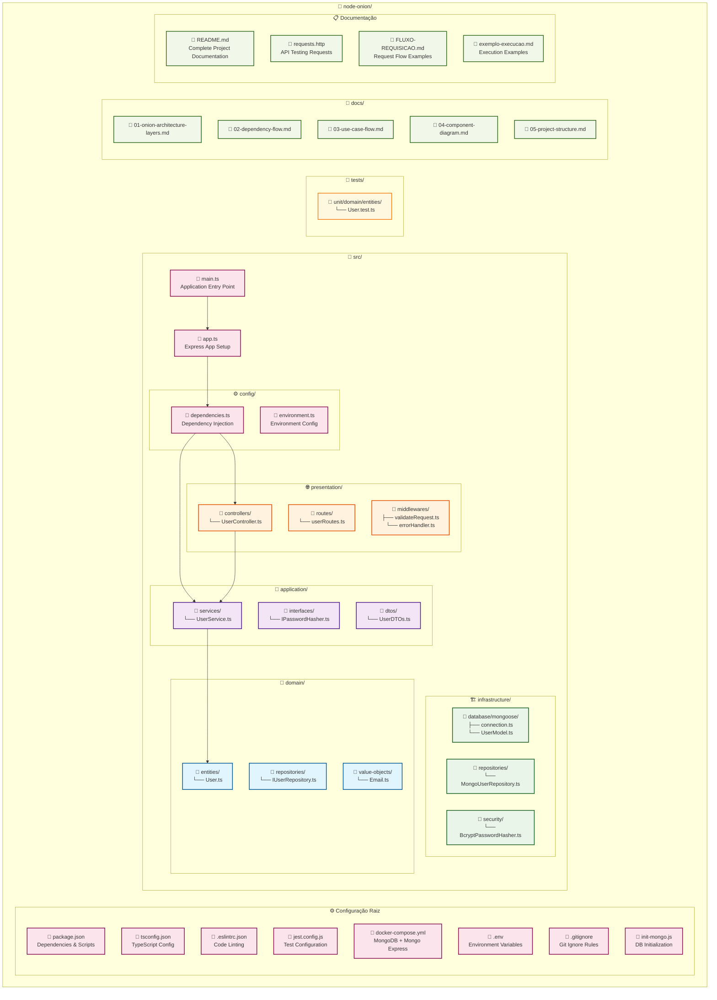

# Estrutura do Projeto

Este diagrama mostra a organização física dos arquivos e pastas do projeto seguindo a arquitetura Onion.

```mermaid
graph TD
    subgraph "📁 node-onion/"
        subgraph "⚙️ Configuração Raiz"
            Package[📄 package.json<br/>Dependencies & Scripts]
            TSConfig[📄 tsconfig.json<br/>TypeScript Config]
            ESLint[📄 .eslintrc.json<br/>Code Linting]
            Jest[📄 jest.config.js<br/>Test Configuration]
            Docker[📄 docker-compose.yml<br/>MongoDB + Mongo Express]
            Env[📄 .env<br/>Environment Variables]
            GitIgnore[📄 .gitignore<br/>Git Ignore Rules]
            InitMongo[📄 init-mongo.js<br/>DB Initialization]
        end
        
        subgraph "📁 src/"
            subgraph "🎯 domain/"
                DomEntities[📁 entities/<br/>└── User.ts]
                DomRepos[📁 repositories/<br/>└── IUserRepository.ts]
                DomValues[📁 value-objects/<br/>└── Email.ts]
            end
            
            subgraph "🔄 application/"
                AppServices[📁 services/<br/>└── UserService.ts]
                AppInterfaces[📁 interfaces/<br/>└── IPasswordHasher.ts]
                AppDTOs[📁 dtos/<br/>└── UserDTOs.ts]
            end
            
            subgraph "🏗️ infrastructure/"
                InfraDB[📁 database/mongoose/<br/>├── connection.ts<br/>└── UserModel.ts]
                InfraRepos[📁 repositories/<br/>└── MongoUserRepository.ts]
                InfraSec[📁 security/<br/>└── BcryptPasswordHasher.ts]
            end
            
            subgraph "🌐 presentation/"
                PresControllers[📁 controllers/<br/>└── UserController.ts]
                PresRoutes[📁 routes/<br/>└── userRoutes.ts]
                PresMiddlewares[📁 middlewares/<br/>├── validateRequest.ts<br/>└── errorHandler.ts]
            end
            
            subgraph "⚙️ config/"
                ConfigDeps[📄 dependencies.ts<br/>Dependency Injection]
                ConfigEnv[📄 environment.ts<br/>Environment Config]
            end
            
            AppFile[📄 app.ts<br/>Express App Setup]
            MainFile[📄 main.ts<br/>Application Entry Point]
        end
        
        subgraph "📁 tests/"
            TestUnit[📁 unit/domain/entities/<br/>└── User.test.ts]
        end
        
        subgraph "📁 docs/"
            DocLayers[📄 01-onion-architecture-layers.md]
            DocDeps[📄 02-dependency-flow.md]
            DocUseCase[📄 03-use-case-flow.md]
            DocComponents[📄 04-component-diagram.md]
            DocStructure[📄 05-project-structure.md]
        end
        
        subgraph "📋 Documentação"
            README[📄 README.md<br/>Complete Project Documentation]
            Requests[📄 requests.http<br/>API Testing Requests]
            FluxoReq[📄 FLUXO-REQUISICAO.md<br/>Request Flow Examples]
            ExemploExec[📄 exemplo-execucao.md<br/>Execution Examples]
        end
    end
    
    %% Relações entre arquivos/pastas
    MainFile --> AppFile
    AppFile --> ConfigDeps
    ConfigDeps --> AppServices
    ConfigDeps --> PresControllers
    AppServices --> DomEntities
    PresControllers --> AppServices
    
    %% Estilos
    classDef config fill:#fce4ec,stroke:#880e4f,stroke-width:2px
    classDef domain fill:#e1f5fe,stroke:#01579b,stroke-width:2px
    classDef application fill:#f3e5f5,stroke:#4a148c,stroke-width:2px
    classDef infrastructure fill:#e8f5e8,stroke:#1b5e20,stroke-width:2px
    classDef presentation fill:#fff3e0,stroke:#e65100,stroke-width:2px
    classDef docs fill:#f1f8e9,stroke:#33691e,stroke-width:2px
    classDef tests fill:#fff8e1,stroke:#f57f17,stroke-width:2px
    
    class Package,TSConfig,ESLint,Jest,Docker,Env,GitIgnore,InitMongo,ConfigDeps,ConfigEnv,AppFile,MainFile config
    class DomEntities,DomRepos,DomValues domain
    class AppServices,AppInterfaces,AppDTOs application
    class InfraDB,InfraRepos,InfraSec infrastructure
    class PresControllers,PresRoutes,PresMiddlewares presentation
    class DocLayers,DocDeps,DocUseCase,DocComponents,DocStructure,README,Requests,FluxoReq,ExemploExec docs
    class TestUnit tests
```
