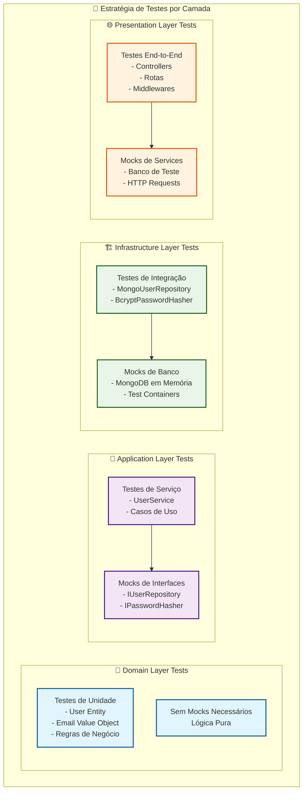

# Estratégia de Testes na Arquitetura Onion

Este diagrama mostra como testar cada camada da arquitetura Onion de forma isolada.

```mermaid
graph TB
    subgraph "🧪 Estratégia de Testes por Camada"
        subgraph "🎯 Domain Layer Tests"
            DomainTests[Testes de Unidade<br/>- User Entity<br/>- Email Value Object<br/>- Regras de Negócio]
            DomainMock[Sem Mocks Necessários<br/>Lógica Pura]
        end
        
        subgraph "🔄 Application Layer Tests"
            ServiceTests[Testes de Serviço<br/>- UserService<br/>- Casos de Uso]
            ServiceMocks[Mocks de Interfaces<br/>- IUserRepository<br/>- IPasswordHasher]
        end
        
        subgraph "🏗️ Infrastructure Layer Tests"
            InfraTests[Testes de Integração<br/>- MongoUserRepository<br/>- BcryptPasswordHasher]
            InfraMocks[Mocks de Banco<br/>- MongoDB em Memória<br/>- Test Containers]
        end
        
        subgraph "🌐 Presentation Layer Tests"
            E2ETests[Testes End-to-End<br/>- Controllers<br/>- Rotas<br/>- Middlewares]
            E2EMocks[Mocks de Services<br/>- Banco de Teste<br/>- HTTP Requests]
        end
    end
    
    %% Relações
    ServiceTests --> ServiceMocks
    InfraTests --> InfraMocks
    E2ETests --> E2EMocks
    
    %% Estilos
    classDef domain fill:#e1f5fe,stroke:#01579b,stroke-width:2px
    classDef application fill:#f3e5f5,stroke:#4a148c,stroke-width:2px
    classDef infrastructure fill:#e8f5e8,stroke:#1b5e20,stroke-width:2px
    classDef presentation fill:#fff3e0,stroke:#e65100,stroke-width:2px
    
    class DomainTests,DomainMock domain
    class ServiceTests,ServiceMocks application
    class InfraTests,InfraMocks infrastructure
    class E2ETests,E2EMocks presentation
```
